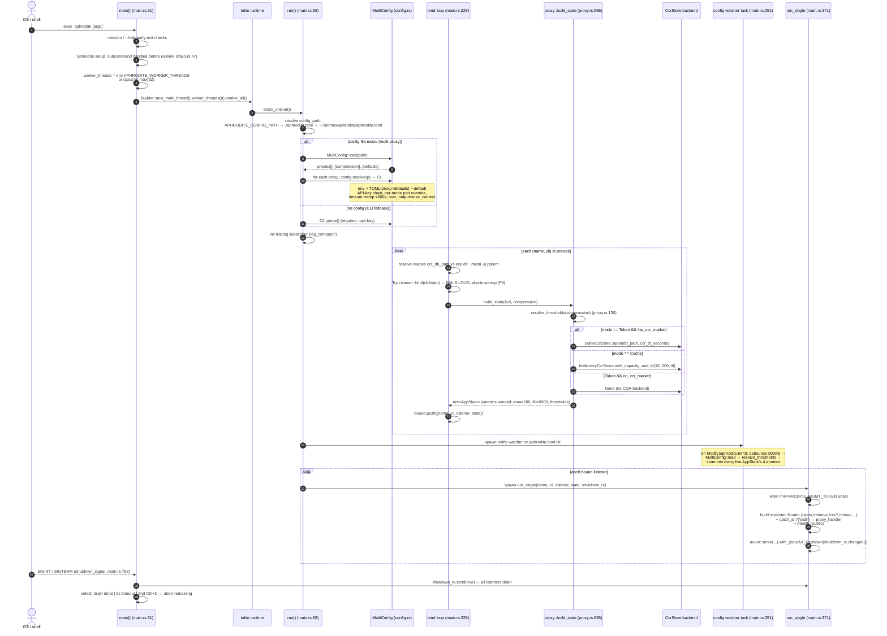
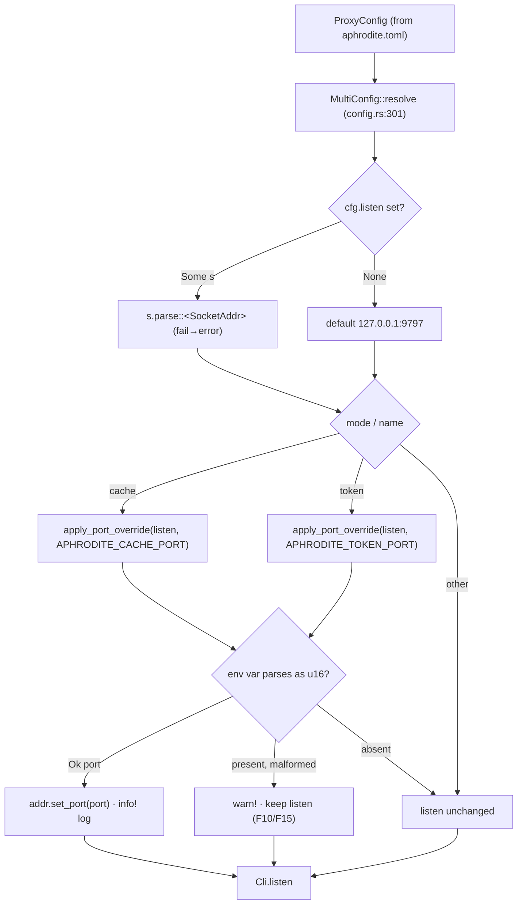
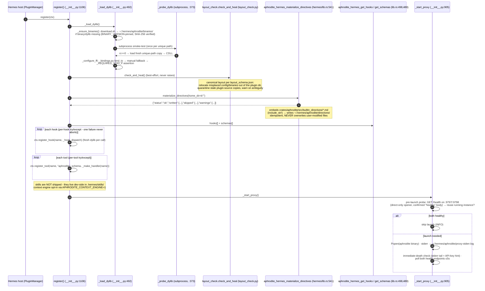

# 01 - Process Startup & Dual-Proxy Launch

Traces `aphrodite` process startup: `main()` → runtime build → config
resolution (env > TOML > default) → bind-before-spawn of every listener →
per-listener `AppState` + CCR store init → config-file hot-reload watcher →
graceful shutdown. The two listeners are the `:9797` cache proxy and `:9798`
token proxy, both bound to loopback. The **plugin's** startup (the Hermes-side
half: dylib probe/load, layout self-heal, directives materialize, proxy launch)
is traced in the second section - `register()` is where the runtime home gets
healed and provisioned before anything consumes it.

## Startup sequence

## Port-override path (env pierces TOML per-mode)

## Plugin startup (register() - the Hermes-side half)

`plugins/aphrodite/__init__.py:register` runs once per Hermes home (one
PluginManager per home). It is a **pure loader**: all logic lives in
`libaphrodite_hermes.dylib`. The runtime artifacts (binary, dylib,
`aphrodite.toml`, `ccr.db`, hotreload cache) live under the canonical runtime
home `~/.hermes/aphrodite`, never inside the plugin tree.

The layout self-heal and directives materialize are best-effort by design:
either failing degrades to a `_log.warning` and the plugin still registers
(never a raise). The dylib load itself is the one hard gate - if the smoke
test or FFI assertion fails, `register()` logs "plugin disabled" and returns.

## Key call sites

- `main()` runtime + subcommand dispatch - `crates/aphrodite/src/main.rs:31`
- `run()` config path resolution + bind-before-spawn - `crates/aphrodite/src/main.rs:98,229`
- config hot-reload watcher - `crates/aphrodite/src/main.rs:251`
- `run_single()` router + serve - `crates/aphrodite/src/main.rs:371`
- `MultiConfig::resolve` / `apply_port_override` - `crates/aphrodite/src/config.rs:301,410`
- `proxy::build_state` (CCR backend selection) - `crates/aphrodite/src/proxy.rs:656`
- `resolve_thresholds` - `crates/aphrodite/src/proxy.rs:130`
- `SqliteCcrStore::open` / `InMemoryCcrStore::with_capacity_and_ttl` - `vendor/headroom/crates/headroom-core/src/ccr/backends/{sqlite.rs:113,in_memory.rs:100}`
- plugin `register()` / `_load_dylib` / `_probe_dylib` / `_start_proxy` - `plugins/aphrodite/__init__.py:1106,492,373,905` (mirror: `crates/aphrodite/templates/__init__.py`)
- layout self-heal `check_and_heal` - `plugins/aphrodite/layout_check.py` (+ `layout_schema.json`)
- directives materialize FFI - `crates/aphrodite-hermes/src/lib.rs:541` (impl `crates/aphrodite-hermes/src/directives.rs:153`)
