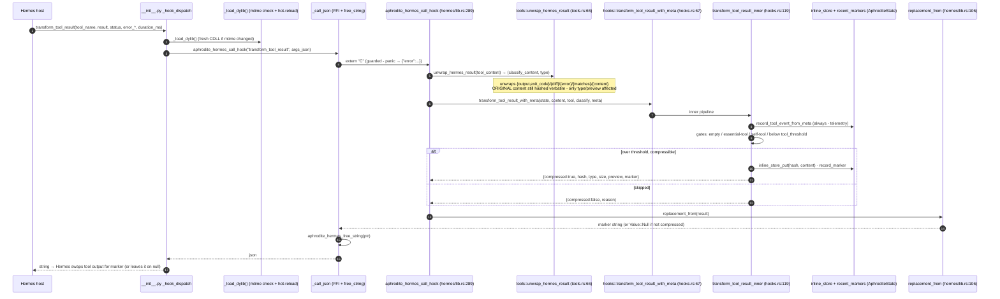
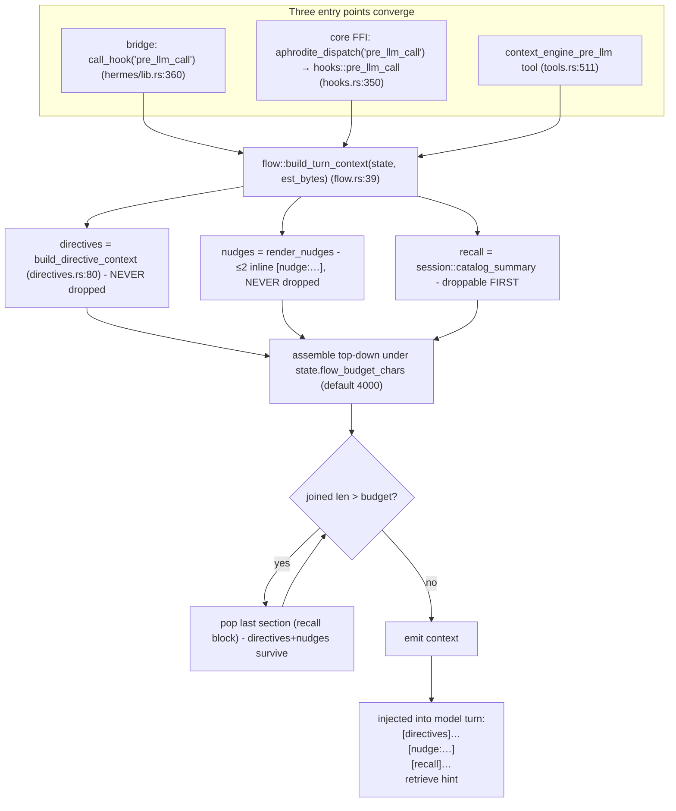
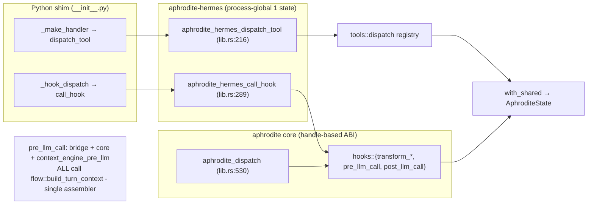

# 04 - Hermes Hook & FFI Path

The Hermes plugin path: Hermes fires a hook → Python ctypes shim
(`__init__.py`) resolves the dylib fresh each call → C ABI in
`aphrodite-hermes/src/lib.rs` (`aphrodite_hermes_call_hook`, panic-guarded) →
core `aphrodite` crate hook bodies. The `pre_llm_call` arm is the **choke
point**: bridge, core `hooks::pre_llm_call`, and the `context_engine_pre_llm`
tool all converge on the single assembler `flow::build_turn_context`, so
directive injection can never fork between paths again (bug class 01-F3).

## Tool-result / terminal-output transform (bridge path)

## pre_llm_call - the directive-injection choke point

`post_llm_call` (hooks.rs:370) is the mirror choke point on both paths:
`archive_turn` (last marker of the turn → `conv_index`) → `next_turn` (turn++)
→ `flow::purge_expired_nudges` (after the counter advances, so a ttl=1 nudge
renders exactly once).

## Parity: bridge path vs core (handle-based) path

Both `guarded()` wrappers (core `lib.rs:137`, hermes `lib.rs:206`) catch panics
across the FFI boundary and return `{"error":"internal error: panicked…"}`
instead of aborting the process. `_with_meta` variants exist only on the bridge
because the handle-based core ABI has no Hermes `status`/`error_type` telemetry
to plumb.

## Key call sites
- Python: `_load_dylib` (hot-reload), `_call_json`, `_hook_dispatch`, `register` - `crates/aphrodite/templates/__init__.py:74,172,368,350` (mirror: `plugins/aphrodite/__init__.py`)
- `aphrodite_hermes_call_hook` (bridge hooks) / `replacement_from` - `crates/aphrodite-hermes/src/lib.rs:289,106`
- `tools::unwrap_hermes_result` / `tools::dispatch` - `crates/aphrodite-hermes/src/tools.rs:66,19`
- `hooks::transform_tool_result_inner` / `pre_llm_call` / `post_llm_call` - `crates/aphrodite/src/hooks.rs:119,350,370`
- `flow::build_turn_context` (assembler) - `crates/aphrodite/src/flow.rs:39`
- core C ABI `guarded` / `aphrodite_dispatch` - `crates/aphrodite/src/lib.rs:137,530`
