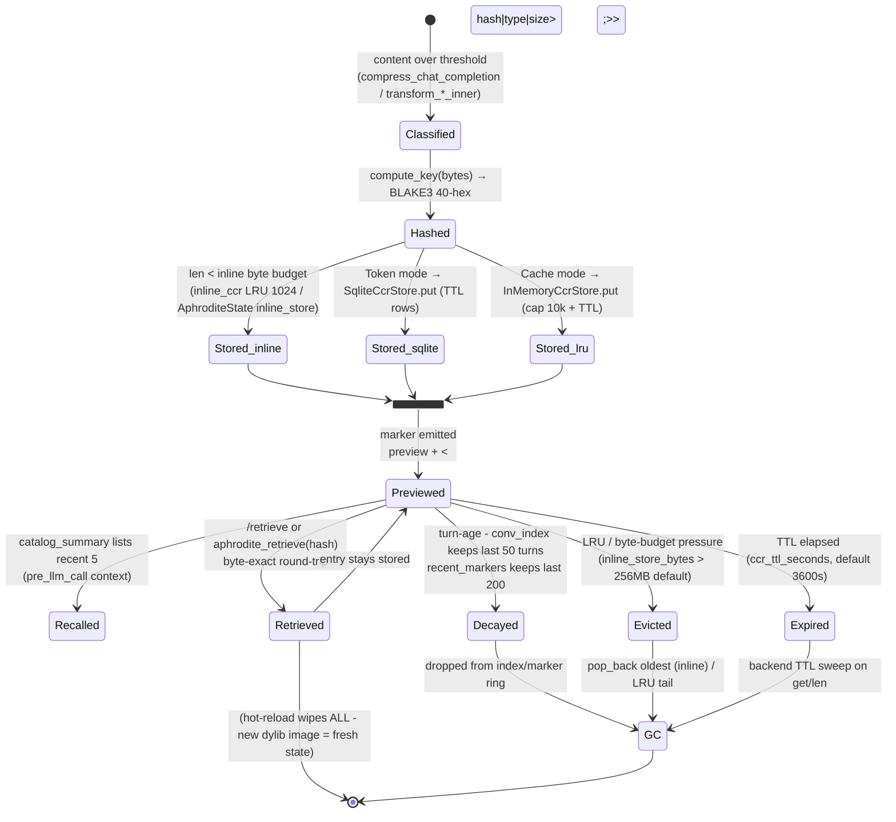
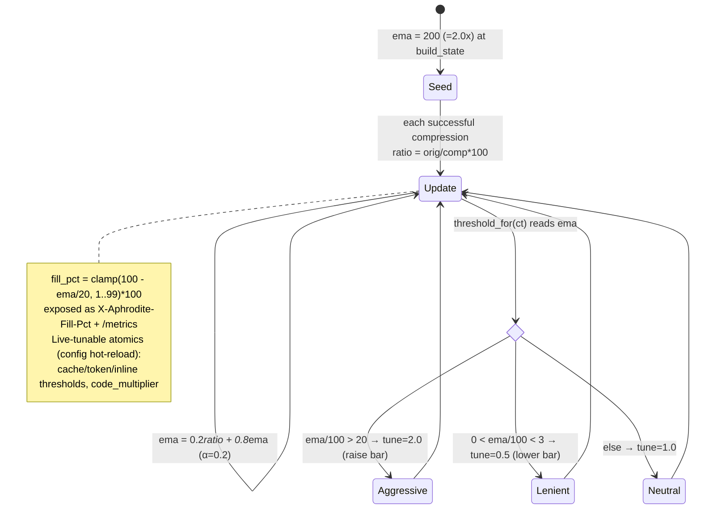

# 05 - CCR Entry Lifecycle & EMA Threshold State

State machine of a single CCR entry from creation through storage, preview,
retrieval, and eviction/decay/GC - plus the separate EMA compression-ratio
state that governs the adaptive threshold.

## CCR entry lifecycle

Notes on eviction tiers (from `state.rs` + backends):
- **inline_store** (AphroditeState): dual bound - `INLINE_MAX = 500` entries
  AND `DEFAULT_INLINE_BYTE_BUDGET = 256MB`; `evict_over_budget` pops oldest
  from the back until both hold (state.rs:187).
- **inline_ccr** (proxy AppState): `lru::LruCache` capped at 1024 entries.
- **recent_markers**: ring capped at 200 (state.rs:228); **conv_index**: last
  50 turns (session.rs:39); **referenced_files**: last 100.
- **SqliteCcrStore / InMemoryCcrStore**: TTL from `ccr_ttl_seconds`; in-memory
  also capped at 10,000 entries.
- **Hot-reload** (see `08-dylib-hotreload.md`) is a hard reset: a new dylib
  image has a fresh `OnceLock`/`HANDLES`, so every prior marker becomes
  unresolvable at once (not a graceful per-entry transition).

## EMA compression-ratio threshold state

## Key call sites
- inline_store eviction (`evict_over_budget`, `inline_store_put`) - `crates/aphrodite/src/state.rs:187,203`
- `record_marker` (cap 200) / `record_tool_event` (cap 200) - `crates/aphrodite/src/state.rs:228,239`
- `archive_turn` (conv_index cap 50) - `crates/aphrodite/src/session.rs:39`
- EMA update / fill_pct - `crates/aphrodite/src/proxy.rs:503,520`
- backend TTL: `SqliteCcrStore` / `InMemoryCcrStore` - `vendor/headroom/crates/headroom-core/src/ccr/backends/{sqlite.rs,in_memory.rs}`
- inline_ccr LRU (1024) - `crates/aphrodite/src/proxy.rs:213`
