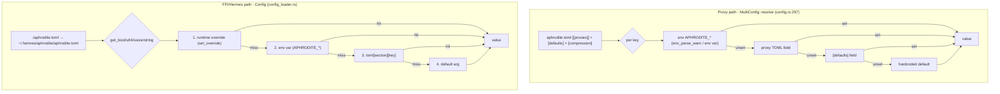
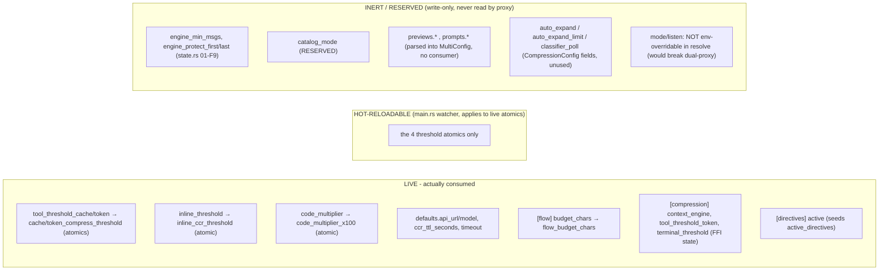

# 07 - Config Resolution Precedence

Two independent resolution stacks share the same **env > TOML > default**
precedence but live in different modules:
- `config.rs` - the proxy's `MultiConfig::resolve` (CLI/`Cli` struct per listener).
- `config_loader.rs` - the FFI/Hermes `Config` loader (`apply_compression` into
  `AphroditeState`).

## Precedence flowchart

## Live vs inert keys

Precedence subtleties:
- The proxy's `resolve` deliberately does **not** give `mode`/`listen` a blanket
  env override - a single process-wide `APHRODITE_MODE`/`APHRODITE_LISTEN` would
  clobber every `[[proxies]]` entry, breaking the cache/token split. Port
  overrides are per-mode (`APHRODITE_CACHE_PORT`/`APHRODITE_TOKEN_PORT`).
- `apply_compression` maps `tool_threshold` (FFI state) to the
  `tool_threshold_token` TOML key / `APHRODITE_TOOL_THRESHOLD_TOKEN` env var -
  the old `tool_threshold` names shipped in no TOML, so wiring them would have
  silently resolved to default forever (F3).
- `env_bool` unifies truthiness to `1`/`true` (case-insensitive); `env_parse_warn`
  warns loudly on a present-but-malformed numeric override instead of silently
  defaulting.

## Key call sites
- `MultiConfig::resolve` (env>TOML>default chains) - `crates/aphrodite/src/config.rs:297`
- `env_bool` / `env_parse_warn` / `apply_port_override` - `crates/aphrodite/src/config.rs:18,33,406`
- `Config::{load,get_bool,get_u64,get_string}` - `crates/aphrodite/src/config_loader.rs:20,66,80,100`
- `Config::apply_compression` - `crates/aphrodite/src/config_loader.rs:124`
- `resolve_thresholds` (proxy defaults + env) - `crates/aphrodite/src/proxy.rs:121`
- hot-reload watcher (4 atomics) - `crates/aphrodite/src/main.rs:251`
