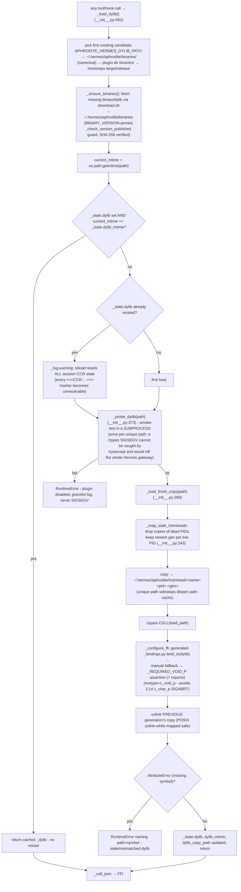
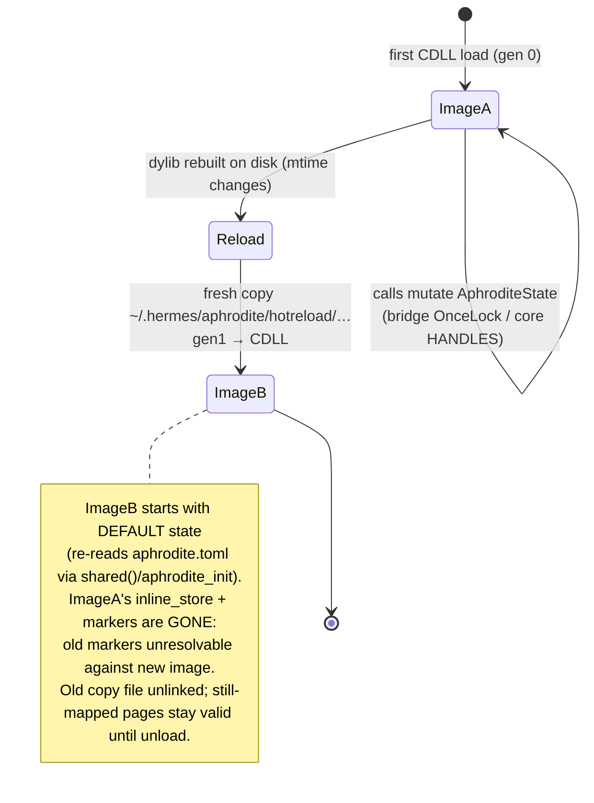

# 08 - Dylib Hot-Reload

The Python shim reloads the Rust dylib when its mtime changes, working around
the fact that `dlopen` memoizes loaded images by canonical path. Each
generation is copied to a unique path before `ctypes.CDLL()`, so genuinely new
code is loaded. A reload wipes all Rust-side session state (fresh
`OnceLock`/`HANDLES`). The copies live in the canonical runtime home
(`~/.hermes/aphrodite/hotreload/`), never inside the plugin tree - the old
in-tree `.hotreload/` grew to ~19 GB across terminated processes and broke
`hermes plugins doctor` tmpfs staging (ENOSPC).

## Hot-reload flow

Concurrency and lifecycle notes:

- `_state` is a **process-global holder** (`aphrodite_hermes._process_state`
  module registered in `sys.modules`, **init**.py:109). Hermes builds one
  PluginManager per home and `exec_module()`s the shim once per home under a
  distinct module name; without the holder, the second load would copy onto the
  very same `<name>.<pid>.0` path the first image already mapped (Windows:
  PermissionError, leak). The mtime early-return makes later shim copies reuse
  the mapped handle.
- `_dylib_lock` (a `threading.Lock`) guards the reload window because ctypes
  releases the GIL during foreign calls - two Hermes threads could otherwise
  race through `_load_dylib`.
- Hooks and tools call `_load_dylib()` **fresh inside each closure** (not the
  registration-time handle), so a hot-reloaded image is picked up on the very
  next call.
- The subprocess probe runs **once per unique path per process**
  (`_state.probed_paths`), not per mtime check - a subprocess spawn on every
  rebuild loop would add latency to every reload.
- `_register_atexit_cleanup` removes this process's own final-generation copy
  on interpreter shutdown; the startup sweep reclaims copies abandoned by dead
  processes.

## State handling across images

## Key call sites

- `_load_dylib` (candidates, auto-fetch, mtime check, probe, reload) - `crates/aphrodite/templates/__init__.py:492`
- `_load_fresh_copy` (unique-path copy into `~/.hermes/aphrodite/hotreload`) - `crates/aphrodite/templates/__init__.py:290`
- `_probe_dylib` (subprocess sentinel, once per path) - `crates/aphrodite/templates/__init__.py:373`
- `_hotreload_dir` / `_reap_stale_hotreloads` / `_pid_alive` / `_register_atexit_cleanup` - `crates/aphrodite/templates/__init__.py:163,243,178,1077`
- `_ensure_binaries` (auto-fetch via download.sh) / `_check_version_published` - `crates/aphrodite/templates/__init__.py:803,751`
- `_configure_ffi` / `_manual_ffi_setup` / `_REQUIRED_VOID_P` - `crates/aphrodite/templates/__init__.py:428,458,56`
- `_call_json` (FFI + same-dylib free) - `crates/aphrodite/templates/__init__.py:636`
- shim mirror (submodule) - `plugins/aphrodite/__init__.py` (byte-identical, asserted by setup.rs)
- Rust-side state homes: `crates/aphrodite-hermes/src/lib.rs:63` (`STATE` OnceLock), `crates/aphrodite/src/lib.rs:75` (`HANDLES`)
