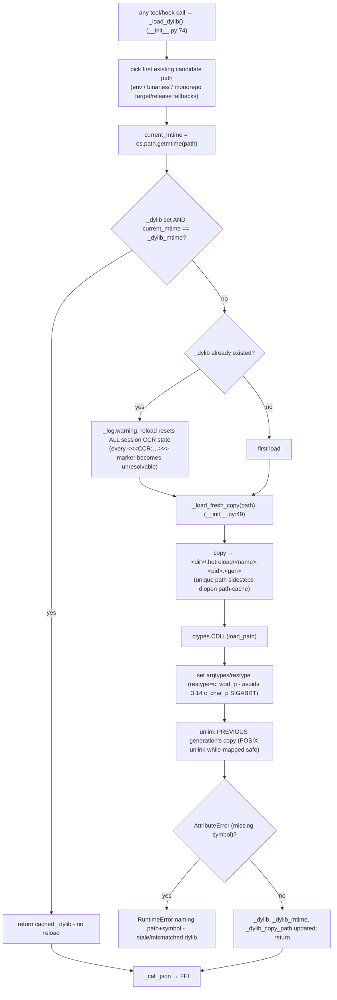
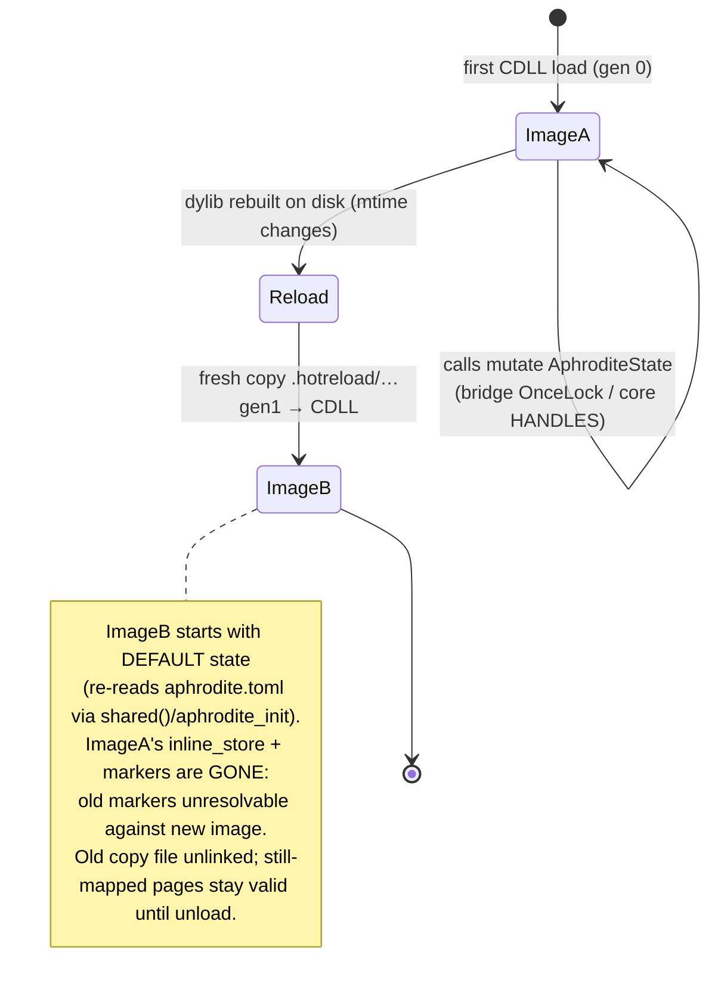

# 08 - Dylib Hot-Reload

The Python shim reloads the Rust dylib when its mtime changes, working around
the fact that `dlopen` memoizes loaded images by canonical path. Each generation
is copied to a unique temp path before `ctypes.CDLL()`, so genuinely new code is
loaded. A reload wipes all Rust-side session state (fresh `OnceLock`/`HANDLES`).

## Hot-reload flow

## State handling across images

Concurrency: `_dylib_lock` (a `threading.Lock`) guards the reload window because
ctypes releases the GIL during foreign calls - two Hermes threads could
otherwise race through `_load_dylib`. Hooks and tools call `_load_dylib()`
**fresh inside each closure** (not the registration-time handle), so a
hot-reloaded image is picked up on the very next call.

## Key call sites
- `_load_dylib` (mtime check, warning, reload) - `crates/aphrodite/templates/__init__.py:74`
- `_load_fresh_copy` (unique temp-path copy) - `crates/aphrodite/templates/__init__.py:49`
- `_dylib_lock` + module globals - `crates/aphrodite/templates/__init__.py:38`
- `_call_json` (FFI + same-dylib free) - `crates/aphrodite/templates/__init__.py:172`
- shim mirror (submodule) - `plugins/aphrodite/__init__.py` (byte-identical)
- Rust-side state homes: `aphrodite-hermes/src/lib.rs:60` (`STATE` OnceLock), `crates/aphrodite/src/lib.rs:73` (`HANDLES`)
