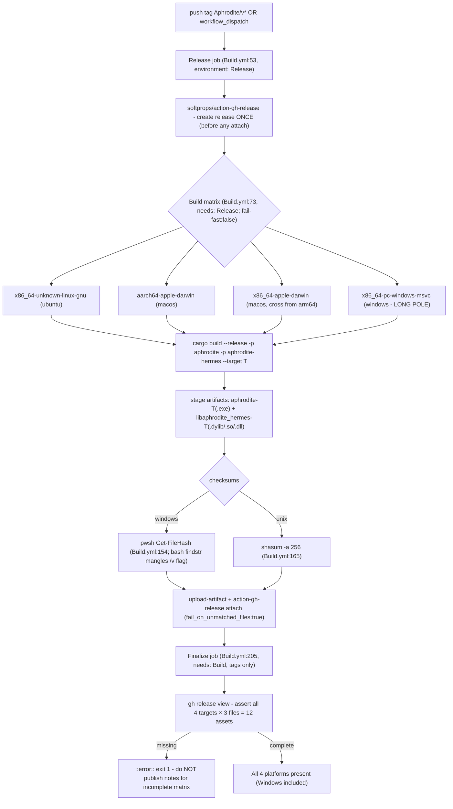
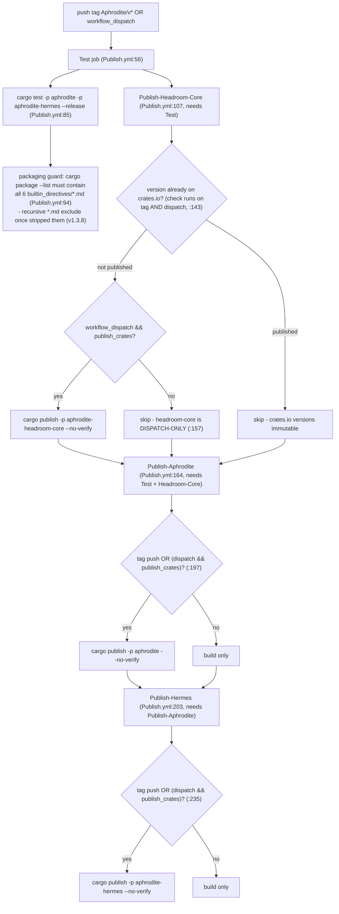

# 09 - Release & Publish CI

Two workflows fire on an `Aphrodite/v*` tag push. `Build.yml` creates the
GitHub release once, then a 4-target matrix builds+attaches per-platform
assets, and a `Finalize` job asserts the matrix came out complete (12 assets:
4 targets × binary + dylib + SHA256SUMS). `Publish.yml` runs tests + a
packaging guard, then a 3-stage crates.io chain: on a **plain tag push** the
`aphrodite` and `aphrodite-hermes` publish steps DO fire, while
`aphrodite-headroom-core` (the vendored dependency published under our own
namespace) publishes only via explicit `workflow_dispatch` with
`publish_crates=true`.

> Correction vs the tracing brief: the "no-finalize-job gap" is **closed** -
> `Build.yml` now has a `Finalize` job (`Build.yml:205`) that fails loudly if
> any of the 12 expected assets are missing. Windows is still the long pole;
> `fail-fast: false` lets every leg finish attaching regardless. (No
> `.githooks`, installer scripts, or `profiles/` tree exist anymore - removed
> from Development in the 1.4.6 cycle; `Maintain/` no longer ships
> `install.sh`/`.ps1`/`.bat`.)

## Build.yml - tag push → release + 4-target matrix

## Publish.yml - test + packaging guard → crates.io chain

Ordering rationale: `aphrodite` path-depends on vendored `headroom-core`
(published under the alias `aphrodite-headroom-core`); `cargo publish` strips
the `path` key, so a matching `aphrodite-headroom-core` version must exist on
crates.io first - hence the strict `Headroom-Core → Aphrodite → Hermes` chain.
The tag-push publish condition on `aphrodite`/`aphrodite-hermes` means a
release tag genuinely publishes the two main crates; only the vendored
`aphrodite-headroom-core` publish step is truly dispatch-only (its
version-check step still runs on tag push so the chain is never blocked).

## Key call sites

- release-once + matrix + Finalize - `.github/workflows/Build.yml:53,73,205`
- Windows checksum PowerShell step - `.github/workflows/Build.yml:154`
- test → packaging guard → 3-stage publish chain - `.github/workflows/Publish.yml:56,94,107,164,203`
- headroom-core version-exists guard (tag AND dispatch) - `.github/workflows/Publish.yml:143`
- tag-push publish conditions (aphrodite + aphrodite-hermes) - `.github/workflows/Publish.yml:197,235`
