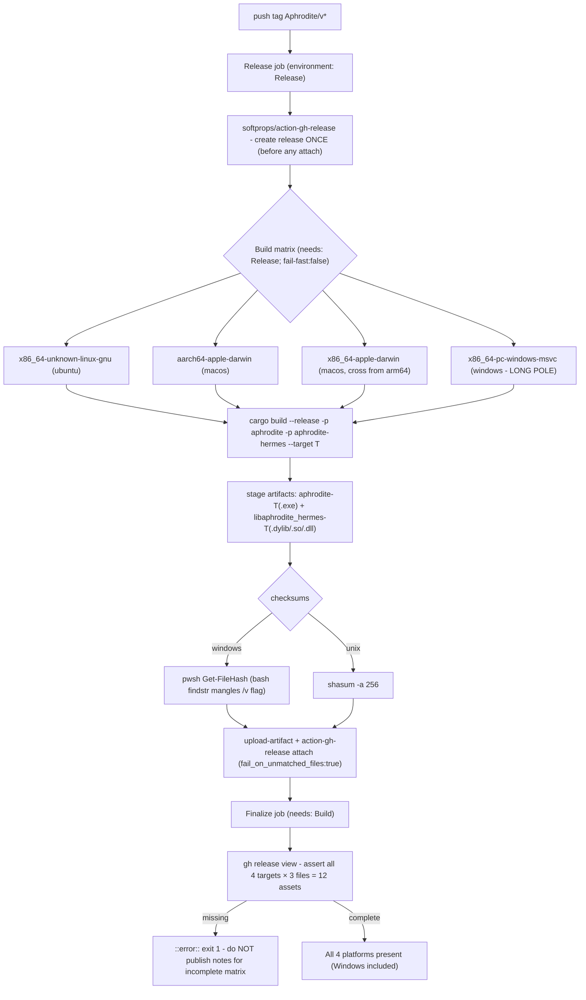
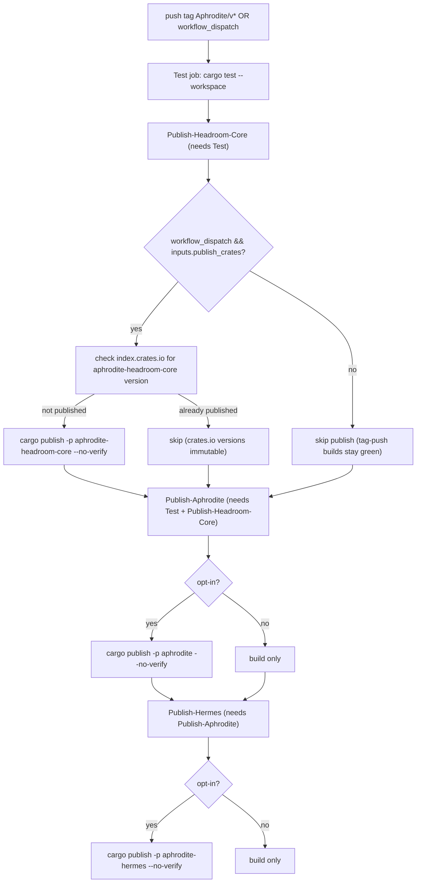

# 09 - Release & Publish CI

Two workflows fire on a `Aphrodite/v*` tag push. `Build.yml` creates the GitHub
release once, then a 4-target matrix builds+attaches per-platform assets, and a
`Finalize` job asserts the matrix came out complete. `Publish.yml` runs tests
then a 3-stage crates.io chain that is opt-in (only via `workflow_dispatch` with
`publish_crates=true`).

> Correction vs the tracing brief: the "no-finalize-job gap" is **closed** in
> v1.3.4 - `Build.yml` now has a `Finalize` job (`Build.yml:205`) that fails
> loudly if any of the 12 expected assets are missing. Windows is still the
> long pole; `fail-fast: false` lets every leg finish attaching regardless.

## Build.yml - tag push → release + 4-target matrix

## Publish.yml - test → opt-in crates.io chain

Ordering rationale: `aphrodite` path-depends on vendored `headroom-core`
(published under the alias `aphrodite-headroom-core`); `cargo publish` strips the
`path` key, so a matching `aphrodite-headroom-core` version must exist on
crates.io first - hence the strict `Headroom-Core → Aphrodite → Hermes` chain,
each gated behind the same opt-in flag so a normal tag push never turns red on a
publish attempt.

## Key call sites
- release-once + matrix + Finalize - `.github/workflows/Build.yml:52,72,205`
- Windows checksum PowerShell step - `.github/workflows/Build.yml:154`
- test → 3-stage publish chain - `.github/workflows/Publish.yml:55,81,138,177`
- crates.io version-exists guard - `.github/workflows/Publish.yml:118`
