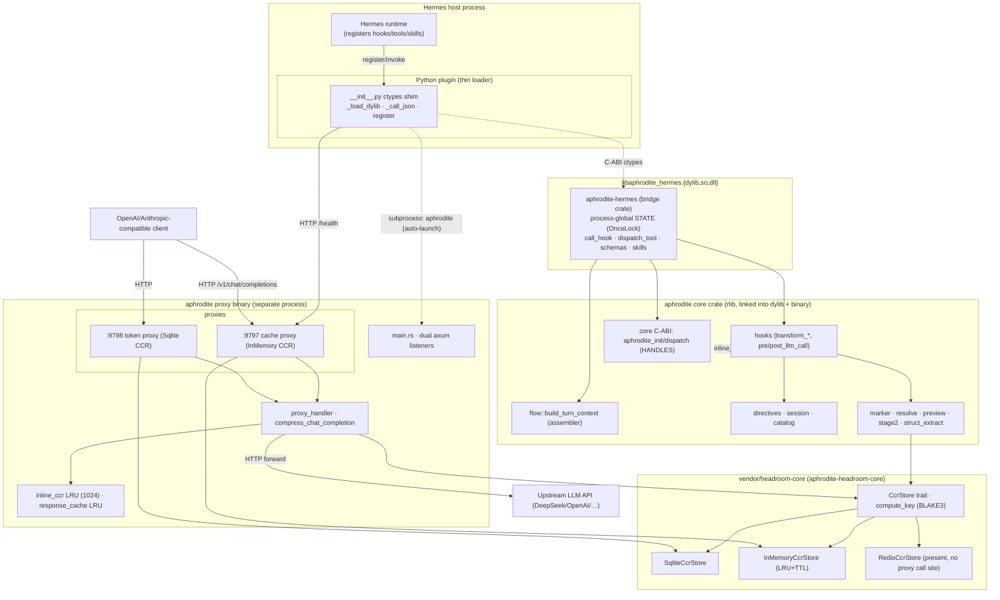

# 10 - Component Diagram

Top-level components and the two boundaries that matter: the **C-ABI** (Python
shim ↔ Rust dylib) and the **HTTP** boundary (LLM clients / Hermes ↔ the two
loopback proxies ↔ upstream API).

Boundary notes:
- **C-ABI (dashed ctypes edges):** `aphrodite-hermes` exposes
  `aphrodite_hermes_*` process-global functions; the core crate additionally
  exposes handle-based `aphrodite_*` functions. Both guard panics via
  `guarded()` so no unwind crosses FFI.
- **HTTP boundary:** clients and Hermes talk to the two loopback listeners;
  `loopback_only` + `require_mgmt_token` middleware gate management routes; the
  catch-all `/{*path}` forwards to upstream.
- **Store backends:** token proxy → SQLite, cache proxy → in-memory LRU; Redis
  is compiled in the vendored crate but wired by no `build_state` arm.
- The **core crate is linked into both** the dylib (Hermes path) and the proxy
  binary - the marker/resolve/preview logic is shared, but the two run in
  separate processes with separate CCR state.

## Key call sites
- bridge crate exports - `crates/aphrodite-hermes/src/lib.rs`
- core C-ABI + hook bodies - `crates/aphrodite/src/{lib.rs,hooks.rs,flow.rs}`
- proxy listeners + handler - `crates/aphrodite/src/{main.rs,proxy.rs}`
- `CcrStore` trait + backends - `vendor/headroom/crates/headroom-core/src/ccr/{mod.rs,backends/}`
- Python shim + subprocess launch - `crates/aphrodite/templates/__init__.py`
