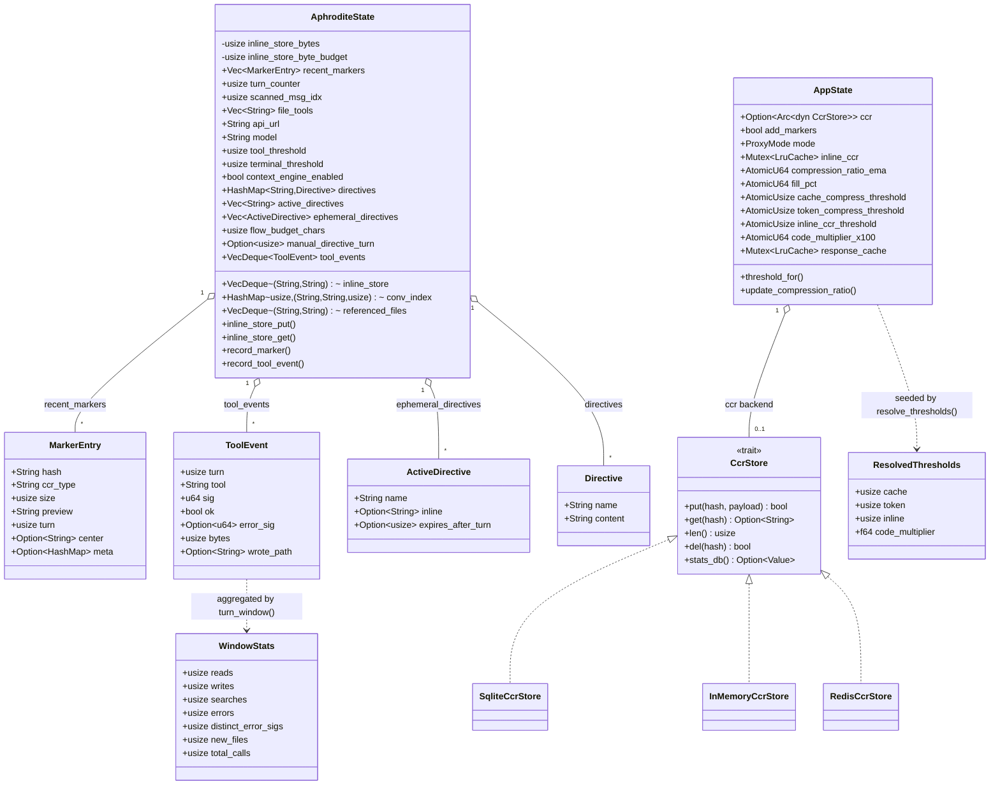

# 11 - Core Data Model (Class Diagram)

The principal data structures across `state.rs`, `session.rs`, `marker.rs`,
`flow.rs`, `directives.rs`, and the vendored `CcrStore` trait. Two distinct
runtime states exist: `AphroditeState` (FFI/Hermes per-session) and `AppState`
(proxy per-listener) - they share the marker/CCR concepts but not the struct.

Relationships / invariants:
- `MarkerEntry.hash` is the BLAKE3 `compute_key` (40 hex) that also keys
  `inline_store`; `conv_index[turn] = (hash, summary, size)` is the last marker
  of that turn, written by `archive_turn`.
- `ToolEvent.sig` = `normalize_args_sig` (FNV-1a, volatile keys stripped);
  `error_sig` = `error_sig(error_type, first line)`. `turn_window(n)` folds the
  ring into `WindowStats` for phase/error-loop detection.
- `ActiveDirective` with `inline=Some(..)` renders as a `[nudge:…]`; `name` set
  keys into `directives`. `expires_after_turn=None` is permanent.
- `AppState` (proxy) holds the live-tunable threshold atomics + the CCR backend
  trait object; `AphroditeState` (FFI) holds the directive/turn/telemetry spine.
  They are **separate structs in separate processes**.

## Key call sites
- `AphroditeState`, `MarkerEntry`, `ToolEvent`, `ActiveDirective` - `crates/aphrodite/src/state.rs:20,93,116,126`
- `Directive` - `crates/aphrodite/src/directives.rs:17`
- `WindowStats` / `normalize_args_sig` / `turn_window` - `crates/aphrodite/src/flow.rs:205,164,216`
- `AppState` / `ResolvedThresholds` - `crates/aphrodite/src/proxy.rs:180,104`
- `CcrStore` trait + backends - `vendor/headroom/crates/headroom-core/src/ccr/mod.rs:40` (+ `backends/`)
- `archive_turn` / `conv_index` - `crates/aphrodite/src/session.rs:39`
