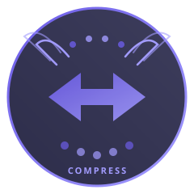

<p align="center">
  
</p>

<h1 align="center">HermesCompress</h1>

<p align="center"><strong>Native headroom integration for Hermes Agent.</strong><br>3 MCP tools + transparent middleware - no monkey-patching.</p>

<p align="center">
  
  
  
  
</p>

---

## Architecture

```
┌────────────────────────────────────────────────────────────┐
│                     Hermes Agent                           │
│                                                            │
│  ┌──────────────────────────────────────────────────┐     │
│  │  llm_request middleware (HERMES_HEADROOM_NATIVE=1)│     │
│  │                                                    │     │
│  │  1. Scan messages for CCR markers                 │     │
│  │  2. Resolve via proxy /v1/retrieve                │     │
│  │  3. If direct API → compress inline via headroom  │     │
│  │  4. If proxy → skip compression (proxy handles it)│     │
│  └──────────────────────────────────────────────────┘     │
│                         ↓                                  │
│              DeepSeek API / Headroom Proxy                 │
└────────────────────────────────────────────────────────────┘
```

**No monkey-patching.** Uses Hermes' native `ctx.register_middleware("llm_request", ...)` API. Runs before the proxy sees the request - breaking the re-compression loop.

### Proxy-aware

| Provider | Middleware behavior |
|----------|-------------------|
| `deepseek-proxy-cache` (:8787) | Resolve CCR only - proxy handles prefix-freeze |
| `deepseek-proxy-token` (:8788) | Resolve CCR only - proxy handles compression |
| `deepseek-direct` (api.deepseek.com) | **Resolve CCR + compress inline** (55-74%) |

### Three MCP Tools

| Tool | Purpose |
|------|---------|
| `headroom_compress` | Compress content on demand via proxy `/v1/compress` |
| `headroom_retrieve` | Resolve CCR markers (local file + proxy + BM25) |
| `headroom_stats` | Proxy compression statistics |

---

## Benchmarks

Inline compression via native middleware (direct API, 50-message session):

| Payload | Stage | Savings |
|---------|-------|:-------:|
| terminal | SmartCrusher | **97.9%** |
| read_file | CodeCompressor | **83.0%** |
| web_search | Kompress | **79.3%** |
| execute_code | SmartCrusher+Compaction | **69.6%** |
| search_files | ContentRouter | **64.6%** |
| cronjob | Full Pipeline | **52.1%** |

Token proxy + tools (live session):

| Metric | Value |
|--------|-------|
| Compression rate | 45-70% (proxy-dependent) |
| Tokens saved | 2.4M+ across sessions |
| Retrieval method | Local file read first, proxy fallback |

---

## Quick Start

### 1. Enable the plugin

```bash
hermes plugins enable headroom
```

### 2. Choose your mode

```bash
# Cache proxy (stable default)
hermes --provider deepseek-proxy-cache

# Token proxy + native middleware (no re-compression loop)
HERMES_HEADROOM_NATIVE=1 hermes --provider deepseek-proxy-token

# Direct API + inline compression (max savings, 55-74%)
HERMES_HEADROOM_NATIVE=1 hermes --provider deepseek-direct
```

### 3. Use the tools

The LLM can call `headroom_compress`, `headroom_retrieve`, and `headroom_stats` directly. No MCP configuration needed.

---

## Provider Configuration

Three providers pre-configured in `~/.hermes/config.yaml`:

```yaml
model:
  provider: deepseek-proxy-cache  # default
  default: deepseek-v4-pro

providers:
  deepseek-proxy-cache:
    base_url: http://127.0.0.1:8787/v1
    api_key_env: DEEPSEEK_API_KEY
    provider: deepseek

  deepseek-proxy-token:
    base_url: http://127.0.0.1:8788/v1
    api_key_env: DEEPSEEK_API_KEY
    provider: deepseek

  deepseek-direct:
    base_url: https://api.deepseek.com/v1
    api_key_env: DEEPSEEK_API_KEY
    provider: deepseek
```

---

## Proxy Management

```bash
# Start dual proxies (cache + token)
.venv/bin/python scripts/proxy-dual.py

# Check stats
curl http://127.0.0.1:8787/stats   # cache mode
curl http://127.0.0.1:8788/stats   # token mode

# Stop
.venv/bin/python scripts/proxy-dual.py --stop
```

---

## For Hermes Agent Developers

A standalone patch is available at `patches/hermes-headroom-native.patch`. Apply it to `~/.hermes/hermes-agent/` to add the `agent/headroom_native.py` module. The plugin auto-detects this module and registers the middleware.

```bash
cd ~/.hermes/hermes-agent
git apply /path/to/HermesCompress/patches/hermes-headroom-native.patch
```
