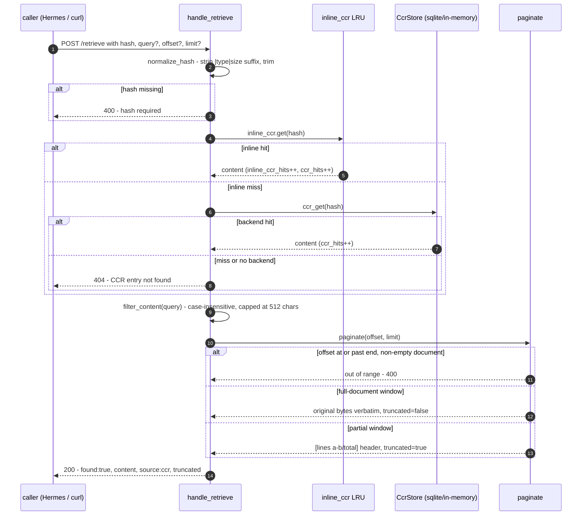

# Retrieve Endpoint

`POST /retrieve` resolves a CCR hash back to its original content, with
optional line filtering and pagination. It is the HTTP path behind the
`aphrodite_retrieve` tool and external callers.

## Endpoint

| Method | Path        | Access   | Auth                                            |
| ------ | ----------- | -------- | ----------------------------------------------- |
| POST   | `/retrieve` | Loopback | Bearer token when `APHRODITE_MGMT_TOKEN` is set |

Loopback only, plus `Authorization: Bearer <token>` when
`APHRODITE_MGMT_TOKEN` is set (unset = any loopback caller, back-compat) - see
[Environment Variables](../config/env-vars.md).

## Request

```json
{
	"hash": "abc123...",
	"query": "optional filter string",
	"offset": 0,
	"limit": 100
}
```

### Request Schema

```rust
pub struct RetrieveRequest {
    pub hash: Option<String>,       // Required
    pub query: Option<String>,      // Optional: case-insensitive line filter
    #[serde(default)]
    pub offset: usize,              // 0-based line offset for pagination
    #[serde(default)]
    pub limit: usize,               // Max lines (0 = FULL document, no cap; explicit limits clamp to 10,000)
}
```

The `hash` argument is normalized before lookup: a `|type|size` marker-body
suffix and surrounding whitespace are stripped, so a hash echoed back in full
marker form still resolves.

## Response

### Success (200)

```json
{
	"found": true,
	"content": "original content...",
	"source": "ccr",
	"error": null,
	"truncated": false
}
```

`truncated` is `true` when `content` is a partial window of a larger stored
document - because of `offset`/`limit`, or because an explicit `limit` hit the
10,000-line server cap. `limit: 0` requests the FULL document and never
truncates - see [Pagination](#pagination).

### Not Found (404)

```json
{
	"found": false,
	"content": null,
	"source": "none",
	"error": "CCR entry not found: abc123...",
	"truncated": false
}
```

### Bad Request (400)

```json
{
	"found": false,
	"content": null,
	"source": "none",
	"error": "`hash` required",
	"truncated": false
}
```

### Pagination Out of Range (400)

```json
{
	"found": false,
	"content": "[offset 500 out of range; document has 42 lines]",
	"source": "ccr",
	"error": null,
	"truncated": false
}
```

### Response Schema

```rust
pub struct RetrieveResponse {
    pub found: bool,
    pub content: Option<String>,
    pub source: String,           // "ccr" on success, "none" on error
    pub truncated: bool,          // true if content is a partial window
    pub error: Option<String>,
}
```

## Retrieve Flow



## Query Filter

```rust
fn filter_content(content: &str, query: Option<&str>) -> String {
    match query {
        Some(q) if !q.is_empty() => {
            // Truncate FIRST, char-boundary-safe, then match case-insensitively
            let q = floor_boundary(q, 512);
            let q_lower = q.to_ascii_lowercase();
            let filtered: Vec<&str> = content
                .lines()
                .filter(|line| line.to_ascii_lowercase().contains(&q_lower))
                .collect();
            if filtered.is_empty() {
                format!("[no lines matching {:?} in {} lines]", q, content.lines().count())
            } else {
                filtered.join("\n")
            }
        },
        _ => content.to_string(),
    }
}
```

| Behavior     | Detail                                       |
| ------------ | -------------------------------------------- |
| Matching     | Case-insensitive substring match per line    |
| Query length | Truncated to 512 chars (char-boundary-safe)  |
| No matches   | Returns `[no lines matching "q" in N lines]` |

## Pagination

`limit: 0` requests the FULL document with no cap - this is the round-trip
contract: a full-document retrieval returns the exact original bytes (the
lossy lines/join round-trip is skipped entirely, so a trailing newline is
preserved and the body hashes back to the marker's own hash). Any explicit
`limit` - including one above 10,000 - is clamped to a 10,000-line server cap.
When the returned window does not cover the whole document (because of
`offset`, an explicit `limit`, or the cap), a `[lines a-b/total]` header is
prepended to `content` and `truncated` is `true`, so a caller can distinguish
a truncated result from a genuinely short document without parsing the header.

An empty stored document (`content: ""`) is a valid zero-line entry, not an
out-of-range offset - it returns empty content with `truncated: false`.

## Source Tracking

| `source` value | Meaning                                           |
| -------------- | ------------------------------------------------- |
| `"ccr"`        | Found - served by the inline store or CCR backend |
| `"none"`       | Not found (error response)                        |

The success path always reports `"ccr"` regardless of which store served the
content. `source` is `"none"` on 400/404 error responses.

## Production Notes

- The inline_ccr lock is dropped before any `.await`, so a `!Send` MutexGuard
  never crosses an await point; the inline check-and-resolve is scoped in a
  block.
- No zstd decompression happens on this path: backends store and return
  content verbatim as UTF-8 strings, so retrieval is byte-exact by
  construction.
