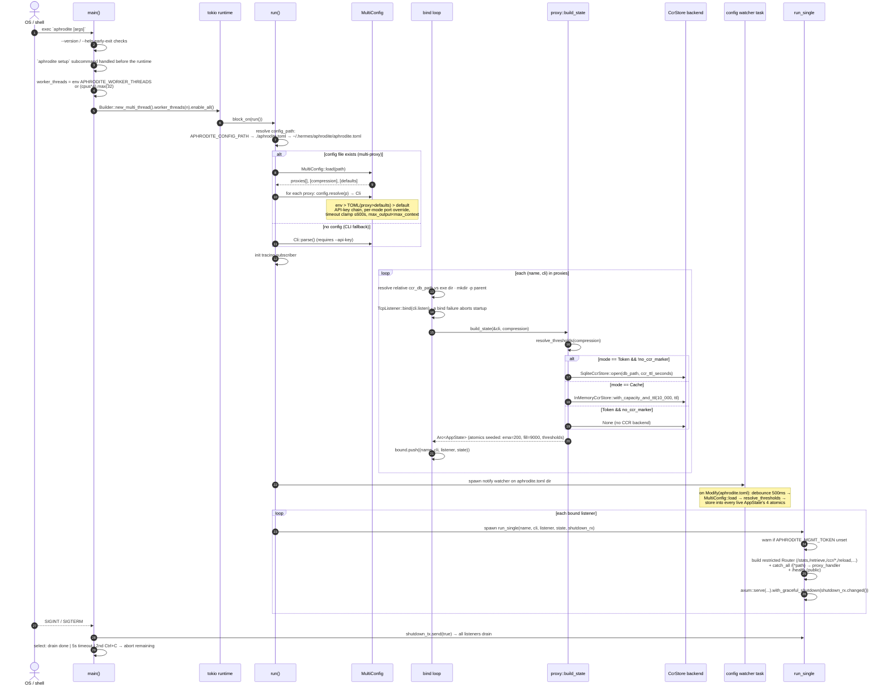
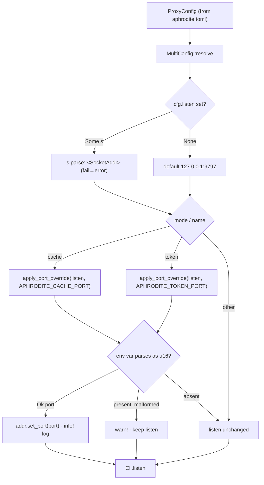
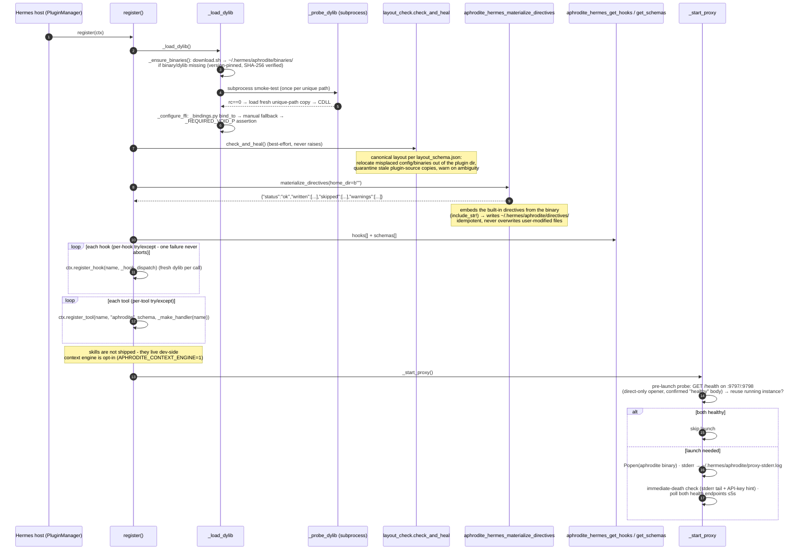

# Process Startup & Dual-Proxy Launch

`aphrodite` startup splits into two halves. The binary half resolves configuration (env > TOML > default), binds every listener before spawning any server, builds one `AppState` per listener with a CCR store backend, and arms a config-file hot-reload watcher. The Hermes plugin half runs once per Hermes home inside `register()`: it loads and smoke-tests the dylib, self-heals the runtime layout, materializes the built-in directives, registers hooks and tools, and launches the proxy when it is not already healthy.

## Startup sequence

## Port override (env pierces TOML per mode)

## Plugin startup (register() - the Hermes-side half)

`register()` runs once per Hermes home (one `PluginManager` per home) and is a **pure loader**: all logic lives in the dylib. Runtime artifacts (binary, dylib, `aphrodite.toml`, `ccr.db`, hot-reload cache) live under the canonical runtime home `~/.hermes/aphrodite`, never inside the plugin tree.

The layout self-heal and the directives materialize are best-effort by design: either failing degrades to a warning and the plugin still registers (never a raise). The dylib load itself is the one hard gate - if the smoke test or the FFI assertion fails, `register()` logs "plugin disabled" and returns.

## Call sites

| Concern                                                               | Module                                                                        |
| --------------------------------------------------------------------- | ----------------------------------------------------------------------------- |
| Runtime + subcommand dispatch                                         | `crates/aphrodite/src/main.rs`                                                |
| Config path resolution + bind-before-spawn                            | `crates/aphrodite/src/main.rs`                                                |
| Config hot-reload watcher                                             | `crates/aphrodite/src/main.rs`                                                |
| Per-listener router + serve                                           | `crates/aphrodite/src/main.rs`                                                |
| `MultiConfig::resolve` / `apply_port_override`                        | `crates/aphrodite/src/config/`                                                |
| `proxy::build_state` (CCR backend selection)                          | `crates/aphrodite/src/proxy.rs`                                               |
| `resolve_thresholds`                                                  | `crates/aphrodite/src/proxy.rs`                                               |
| `SqliteCcrStore` / `InMemoryCcrStore`                                 | `vendor/headroom/crates/headroom-core/src/ccr/backends/{sqlite,in_memory}.rs` |
| Plugin `register()` / `_load_dylib` / `_probe_dylib` / `_start_proxy` | `plugins/aphrodite/__init__.py`                                               |
| Layout self-heal                                                      | `plugins/aphrodite/layout_check.py` (+ `layout_schema.json`)                  |
| Directives materialize FFI                                            | `crates/aphrodite-hermes/src/lib.rs`                                          |
