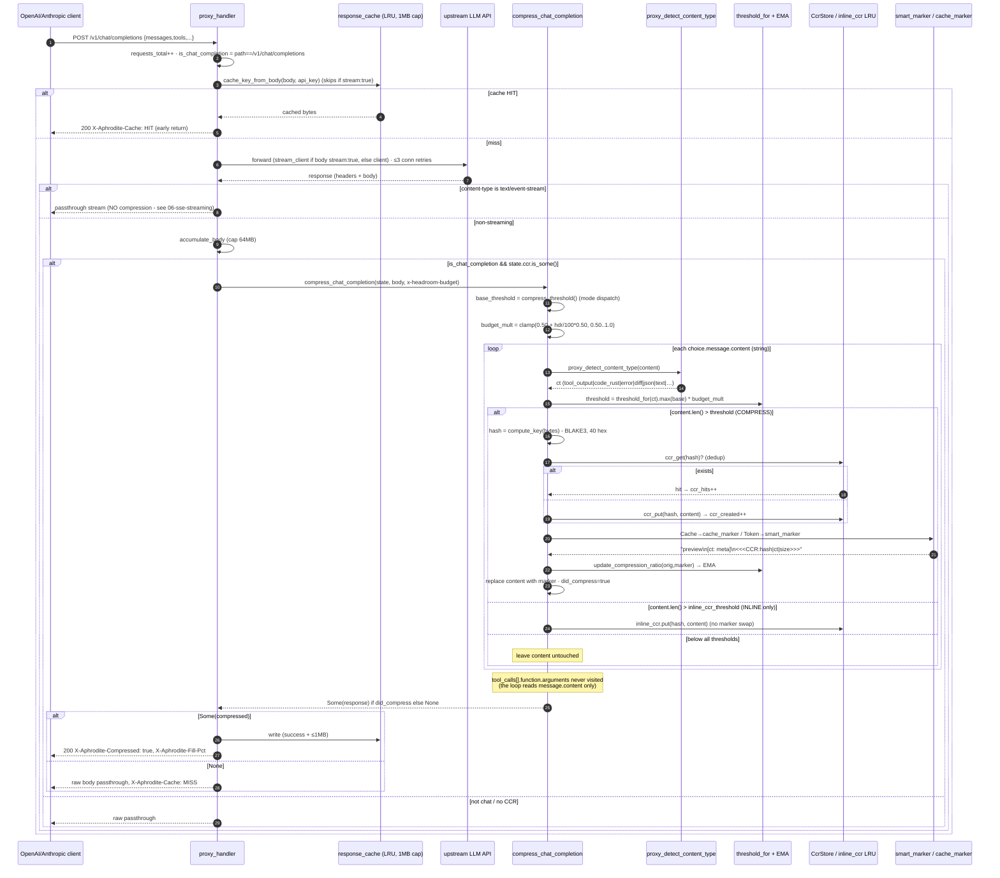
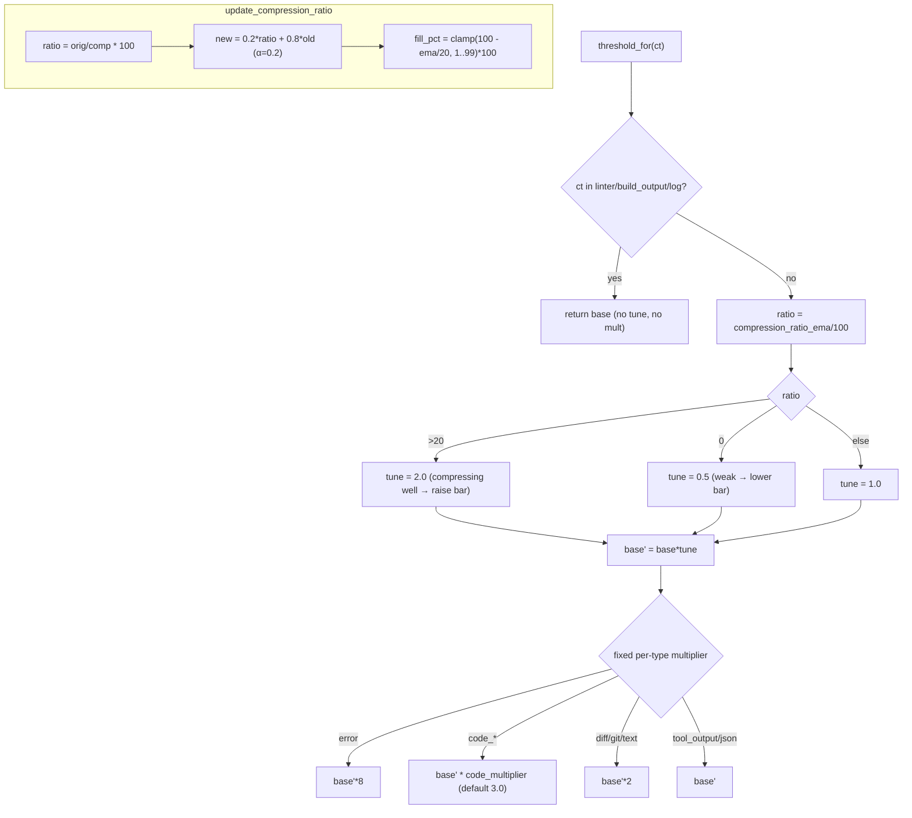

# Chat-Completion Compression

The token and cache proxies' central flow: a `/v1/chat/completions` response comes back from upstream, and `compress_chat_completion` classifies each `message.content`, applies an EMA-tuned per-type threshold (scaled by the `x-headroom-budget` header), BLAKE3-hashes over-threshold content, stores it, and replaces the text with a self-describing preview plus a `<<<CCR:hash|type|size>>>` marker. `tool_calls[].function.arguments` is a sibling field the loop never visits, so it always passes through untouched.

The HTTP proxy path is a separate pipeline from the Hermes FFI hook path: it classifies via `proxy_detect_content_type` and builds previews via `proxy_build_preview`, and never calls the staged transform pipeline (`transforms::detect`, `stage2::compress_stage2`, `struct_extract::extract_code_structure`) - those run only on the Hermes hook path (see [04-hook-ffi.md](04-hook-ffi.md)). The two pipelines share the BLAKE3 `compute_key` and the marker wire format, but nothing else.

## Response compression sequence

## Per-type threshold (EMA auto-tune → fixed multiplier)

## Call sites

| Concern                                                           | Module                                                |
| ----------------------------------------------------------------- | ----------------------------------------------------- |
| `proxy_handler` request/response orchestration                    | `crates/aphrodite/src/proxy.rs`                       |
| `compress_chat_completion`                                        | `crates/aphrodite/src/proxy.rs`                       |
| `proxy_detect_content_type` (classify)                            | `crates/aphrodite/src/proxy.rs`                       |
| `proxy_build_preview` / `proxy_format_ccr_output`                 | `crates/aphrodite/src/proxy.rs`                       |
| `threshold_for` / `update_compression_ratio` / `compute_fill_pct` | `crates/aphrodite/src/proxy.rs`                       |
| `compute_key` (BLAKE3, 40-hex)                                    | `vendor/headroom/crates/headroom-core/src/ccr/mod.rs` |
| `smart_marker` / `cache_marker`                                   | `crates/aphrodite/src/proxy.rs`                       |
| tool_calls pass-through rationale + test                          | `crates/aphrodite/src/proxy.rs`                       |
