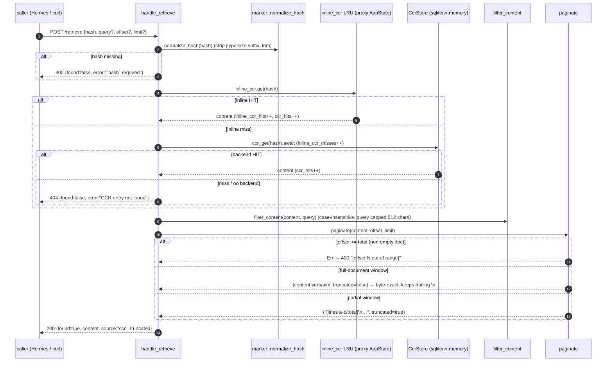
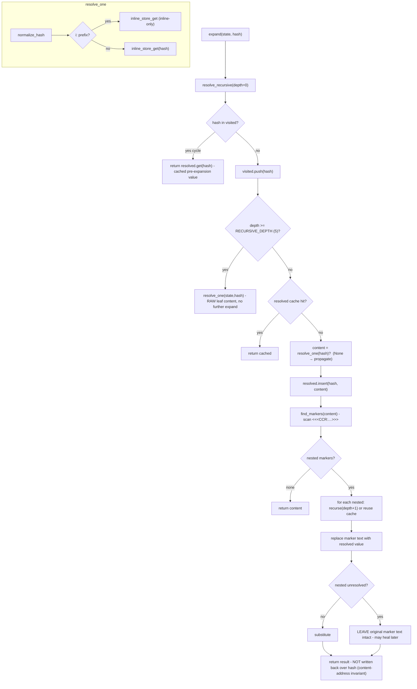

# Retrieve & Recursive Marker Resolution

Two related paths turn a `<<<CCR:hash|type|size>>>` marker back into content: the HTTP `/retrieve` endpoint (inline_ccr → CcrStore, query filter + pagination, byte-exact round-trip) and the in-process recursive resolver `resolve::expand` (nested markers, depth limit, cycle-safe, never writes back).

## /retrieve HTTP path

Pagination facts: an explicit nonzero `limit` clamps to a 10,000-line server cap; `limit == 0` is not capped and returns the full document. An empty stored document (`content: ""`) is a valid zero-line result, not an out-of-range offset. A full-window retrieval skips the lossy `lines()/join()` round-trip entirely, so the returned bytes hash back to the marker's own hash.

## Recursive resolution (resolve::expand)

`find_markers` walks `<<<CCR:` … `>>>` pairs, tolerating unclosed prefixes without panicking. `marker::extract_hashes` additionally recognizes `[CCR:…]` and the `⫷…⫸` glyph forms via a `LazyLock` regex whose hash class is anchored to `[0-9a-fA-F:i]{6,64}` (never crossing a newline).

## Call sites

| Concern                                                 | Module                             |
| ------------------------------------------------------- | ---------------------------------- |
| `handle_retrieve`                                       | `crates/aphrodite/src/retrieve.rs` |
| `filter_content` / `paginate`                           | `crates/aphrodite/src/retrieve.rs` |
| `resolve::expand` / `resolve_recursive` / `resolve_one` | `crates/aphrodite/src/resolve.rs`  |
| `find_markers` / `parse_marker_hash`                    | `crates/aphrodite/src/resolve.rs`  |
| `normalize_hash` / `extract_hashes` (HASH_RE)           | `crates/aphrodite/src/marker.rs`   |
