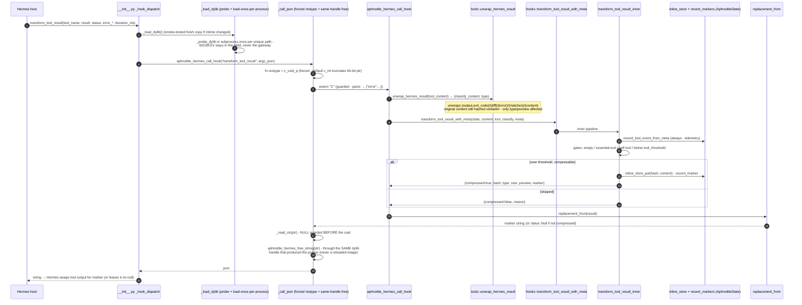
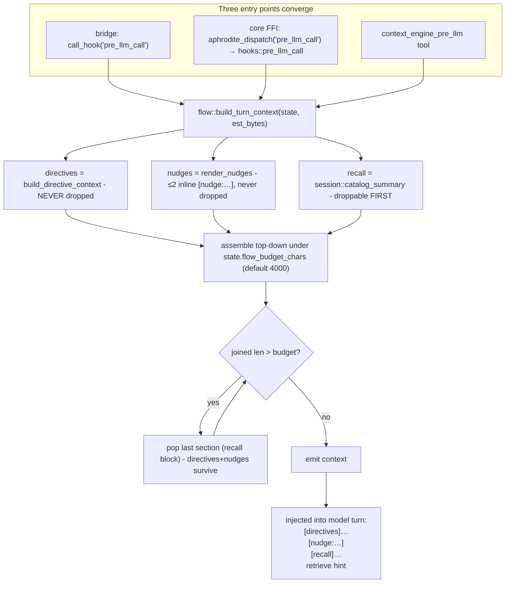
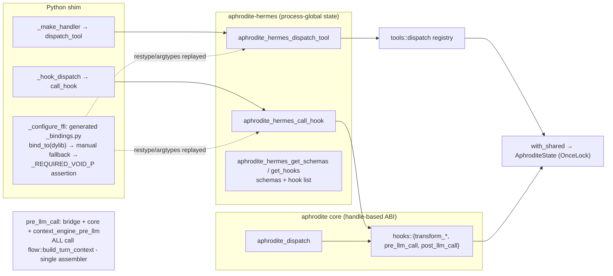

# Hermes Hook & FFI Path

The Hermes plugin path: Hermes fires a hook → the Python ctypes shim resolves the dylib fresh for each call → the C ABI in `crates/aphrodite-hermes` (`aphrodite_hermes_call_hook`, panic-guarded) → the core `aphrodite` crate hook bodies. The `pre_llm_call` arm is the choke point: the bridge, the core `hooks::pre_llm_call`, and the `context_engine_pre_llm` tool all converge on the single assembler `flow::build_turn_context`, so directive injection can never fork between paths.

FFI declarations come from the **generated `_bindings.py`** (cbindgen → ctypesgen, regenerated by the build script whenever the C ABI surface changes): `bind_to(dylib)` replays restype/argtypes onto the plugin's own CDLL handle - the generated module never loads a library itself. When the artifact is absent (fresh checkout, `aphrodite setup` install) or fails to apply, the shim degrades to the manual `_manual_ffi_setup` fallback; on every load, `_REQUIRED_VOID_P` asserts each pointer-returning export reads at full 64-bit width (a truncated default `c_int` restype would SIGSEGV in `_read_str`). `_probe_dylib` smoke-tests each unique dylib path in a subprocess first, so a faulting image degrades to a graceful "plugin disabled" instead of killing the gateway.

## Tool-result / terminal-output transform (bridge path)

`_call_json` frees every pointer through the exact dylib object that allocated it, never through a cached or reloaded handle - benign today while both generations use the system allocator, undefined behavior the day a custom global allocator lands.

## pre_llm_call - the directive-injection choke point

`post_llm_call` is the mirror choke point on both paths: `archive_turn` (last marker of the turn → `conv_index`) → `next_turn` (turn++) → `flow::purge_expired_nudges` (after the counter advances, so a `ttl=1` nudge renders exactly once) → `poll_worker::expire_stale_tasks`.

## Parity: bridge path vs core (handle-based) path

Both `guarded()` wrappers (core and bridge) catch panics across the FFI boundary and return `{"error":"internal error: panicked…"}` instead of aborting the process. The `_with_meta` variants exist only on the bridge, because the handle-based core ABI has no Hermes `status`/`error_type` telemetry to plumb. The bridge exposes no skill export; the plugin registers tools and hooks only, and skills live dev-side.

## Call sites

| Concern                                                                       | Module                                 |
| ----------------------------------------------------------------------------- | -------------------------------------- |
| `_load_dylib` (probe + load-once), `_call_json`, `_hook_dispatch`, `register` | `plugins/aphrodite/__init__.py`        |
| FFI setup: `_configure_ffi` / `_manual_ffi_setup` / `_REQUIRED_VOID_P`        | `plugins/aphrodite/__init__.py`        |
| `_probe_dylib` (subprocess smoke test) / `_read_str` (NULL guard)             | `plugins/aphrodite/__init__.py`        |
| `aphrodite_hermes_call_hook` (bridge hooks) / `replacement_from`              | `crates/aphrodite-hermes/src/lib.rs`   |
| `tools::unwrap_hermes_result` / `tools::dispatch`                             | `crates/aphrodite-hermes/src/tools.rs` |
| `hooks::transform_tool_result_inner` / `pre_llm_call` / `post_llm_call`       | `crates/aphrodite/src/hooks.rs`        |
| `flow::build_turn_context` (assembler)                                        | `crates/aphrodite/src/flow.rs`         |
| Core C ABI `guarded` / `aphrodite_dispatch`                                   | `crates/aphrodite/src/lib.rs`          |
