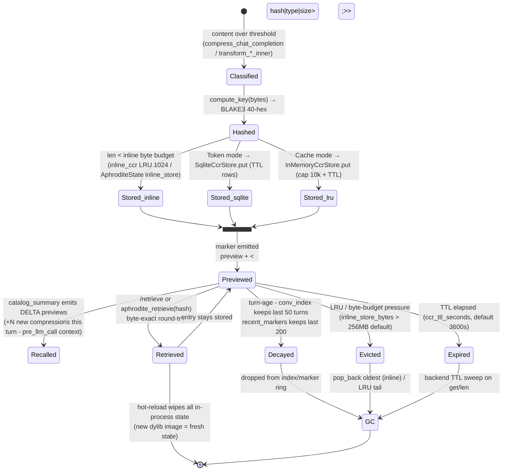
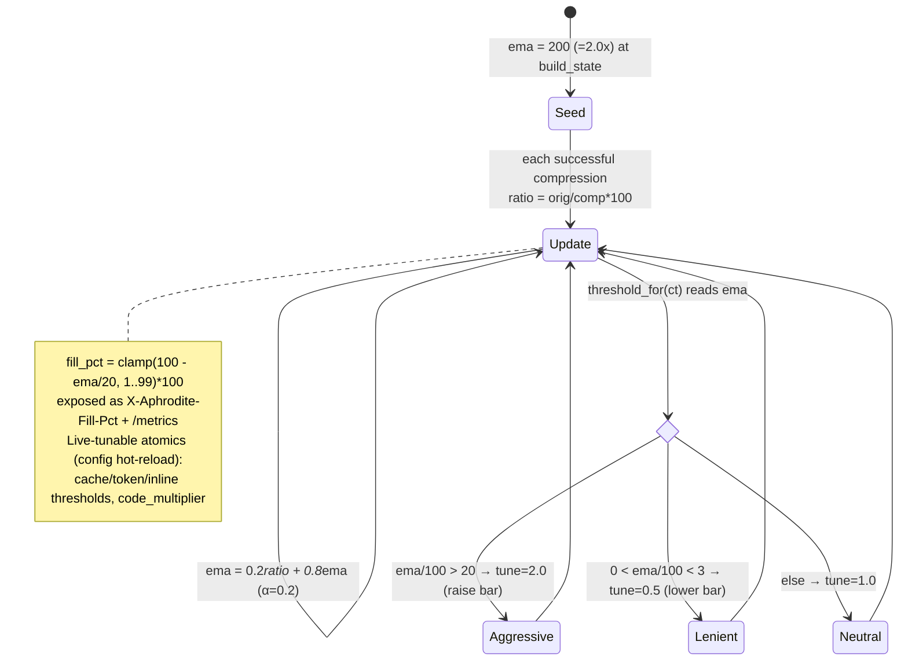

# CCR Entry Lifecycle & EMA Threshold State

State machine of a single CCR entry from creation through storage, preview, retrieval, and eviction/decay/GC - plus the separate EMA compression-ratio state that governs the adaptive threshold.

## CCR entry lifecycle

Eviction tiers:

| Store                                 | Bound                                                                               | Eviction                                                      |
| ------------------------------------- | ----------------------------------------------------------------------------------- | ------------------------------------------------------------- |
| `inline_store` (AphroditeState)       | 500 entries AND 256 MB byte budget                                                  | `evict_over_budget` pops oldest from the back until both hold |
| `inline_ccr` (proxy AppState)         | 1024 entries (LRU)                                                                  | LRU tail                                                      |
| `recent_markers`                      | 200 markers (ring)                                                                  | oldest dropped                                                |
| `conv_index`                          | last 50 turns                                                                       | oldest turn removed                                           |
| `referenced_files`                    | last 100 files                                                                      | oldest dropped                                                |
| `SqliteCcrStore` / `InMemoryCcrStore` | TTL from `ccr_ttl_seconds` (default 3600s); in-memory also capped at 10,000 entries | lazy TTL sweep on get/len                                     |

A dylib hot-reload is a hard reset: a new dylib image has a fresh `OnceLock`/handles, so every prior marker becomes unresolvable at once (not a graceful per-entry transition).

## EMA compression-ratio threshold state

## Call sites

| Concern                                                   | Module                                                                        |
| --------------------------------------------------------- | ----------------------------------------------------------------------------- |
| `evict_over_budget` / `inline_store_put`                  | `crates/aphrodite/src/state/`                                                 |
| `record_marker` (cap 200) / `record_tool_event` (cap 200) | `crates/aphrodite/src/state/`                                                 |
| `archive_turn` (conv_index cap 50)                        | `crates/aphrodite/src/session.rs`                                             |
| EMA update / `compute_fill_pct`                           | `crates/aphrodite/src/proxy.rs`                                               |
| Backend TTL: `SqliteCcrStore` / `InMemoryCcrStore`        | `vendor/headroom/crates/headroom-core/src/ccr/backends/{sqlite,in_memory}.rs` |
| inline_ccr LRU (1024)                                     | `crates/aphrodite/src/proxy.rs`                                               |
