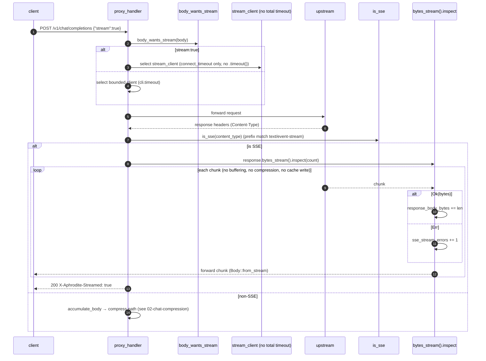
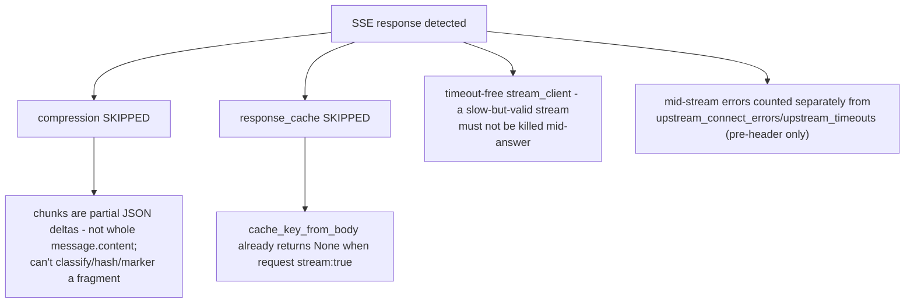

# SSE Streaming Passthrough

Server-sent-event (`text/event-stream`) responses bypass compression and the response cache entirely, stream chunk-by-chunk with a timeout-free client, and account bytes and errors mid-stream. Detection happens twice: on the request (`"stream": true` selects the timeout-free client) and on the response (`Content-Type` selects the passthrough branch).

## SSE detection & passthrough

## Why compression is skipped for SSE

Byte accounting: only `response_body_bytes` accumulates during the stream (via the `.inspect` closure); `tokens_saved` is not touched because nothing was compressed. `sse_stream_errors` surfaces in `/stats` and `/metrics` (`aphrodite_sse_stream_errors_total`).

## Call sites

| Concern                                                           | Module                          |
| ----------------------------------------------------------------- | ------------------------------- |
| `body_wants_stream` (request-side detection)                      | `crates/aphrodite/src/proxy.rs` |
| `stream_client` construction (no total timeout)                   | `crates/aphrodite/src/proxy.rs` |
| Client selection in handler                                       | `crates/aphrodite/src/proxy.rs` |
| `is_sse` (response-side detection)                                | `crates/aphrodite/src/proxy.rs` |
| SSE stream branch (`bytes_stream().inspect`, byte/error counting) | `crates/aphrodite/src/proxy.rs` |
| `sse_stream_errors` in `/metrics`                                 | `crates/aphrodite/src/main.rs`  |
