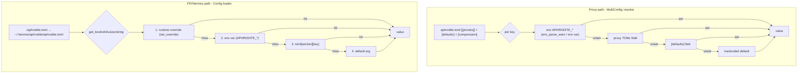
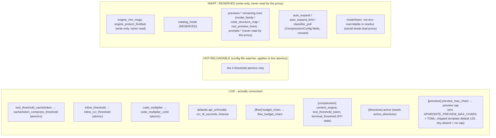

# Config Resolution Precedence

Two independent resolution stacks share the same **env > TOML > default** precedence but live in different modules: the proxy's `MultiConfig::resolve`, which produces one `Cli` per listener, and the Hermes/FFI `Config` loader, whose `apply_compression` writes straight into `AphroditeState`. Both read the same `aphrodite.toml`, and only a small set of keys is actually consumed at runtime - most of the schema is inert or reserved.

## Precedence flowchart

## Live vs inert keys

Precedence subtleties:

- The proxy's `resolve` deliberately gives `mode`/`listen` no blanket env override - a process-wide `APHRODITE_MODE`/`APHRODITE_LISTEN` would clobber every `[[proxies]]` entry and break the cache/token split. Port overrides stay per-mode (`APHRODITE_CACHE_PORT` / `APHRODITE_TOKEN_PORT`).
- `apply_compression` maps the FFI state's `tool_threshold` to the `tool_threshold_token` TOML key and the `APHRODITE_TOOL_THRESHOLD_TOKEN` env var. The old `tool_threshold` names shipped in no TOML, so wiring them as-is would have silently resolved to the default forever.
- `env_bool` accepts `1`/`true` (case-insensitive) as truthy and everything else as false; `env_parse_warn` warns loudly on a present-but-malformed numeric override instead of silently defaulting.
- `[previews] preview_max_chars` caps rendered previews (env `APHRODITE_PREVIEW_MAX_CHARS` wins over TOML). The shipped config template sets 120; when the key is absent the preview builder applies no cap. It is applied at proxy startup and whenever the FFI config is (re)loaded - a dylib reload re-applies it, but the config-file watcher does not.
- The config-file watcher reacts to `Modify` events on `aphrodite.toml` (500 ms debounce), reloads the file, and stores the four resolved thresholds (`cache`, `token`, `inline`, `code_multiplier`) into every live `AppState`'s atomics. Nothing else is hot-updated.
