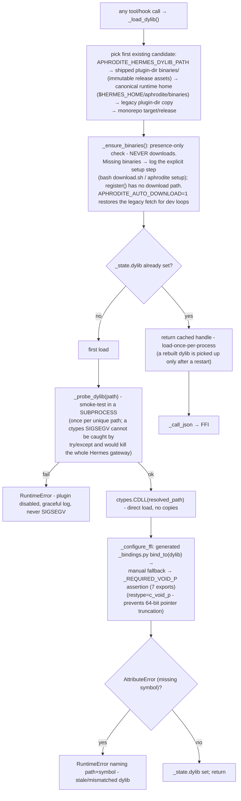
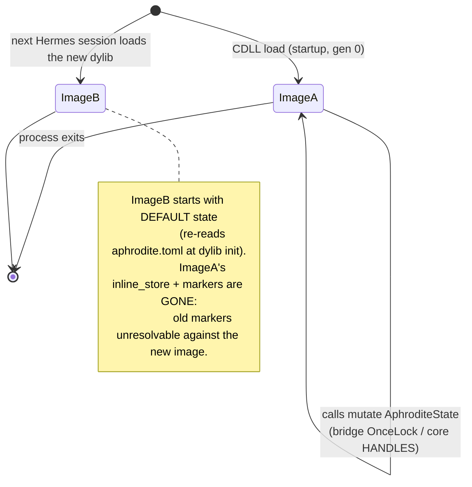

# Dylib Loading (load-once per process)

The Python shim loads the Rust dylib exactly once per process from the
resolved path (`ctypes.CDLL` on the canonical candidate). There is **no
hot-reload**: `dlopen` memoizes loaded images by canonical path, and the
plugin does not work around that with fresh copies. To pick up a newly
built dylib, **restart the Hermes session** - a new process loads the new
image; a running process keeps the image it loaded at startup.

## Load flow

## Notes

- `_state` is a process-global holder (a module registered in `sys.modules`).
  Hermes builds one plugin manager per home and executes the shim once per
  home under a distinct module name; without the holder, the second load
  would call `CDLL` again on the same canonical path and reuse the mapped
  image (or fail on Windows where a second open of a loaded library is
  denied). The early-return makes later shim copies reuse the mapped handle.
- `_dylib_lock` (a `threading.Lock`) guards the first-load window because
  ctypes releases the GIL during foreign calls - two Hermes threads could
  otherwise race through `_load_dylib`.
- Hooks and tools call `_load_dylib()` fresh inside each closure (not a
  registration-time handle); the holder early-return makes that cheap.
- The subprocess probe runs once per unique path per process - spawning a
  subprocess on every call would add latency to every hook/tool call.
- No `hotreload/` directory is ever created; no copies are written anywhere
  in the runtime home.

## State handling across processes

