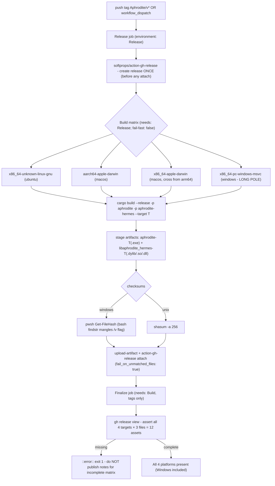
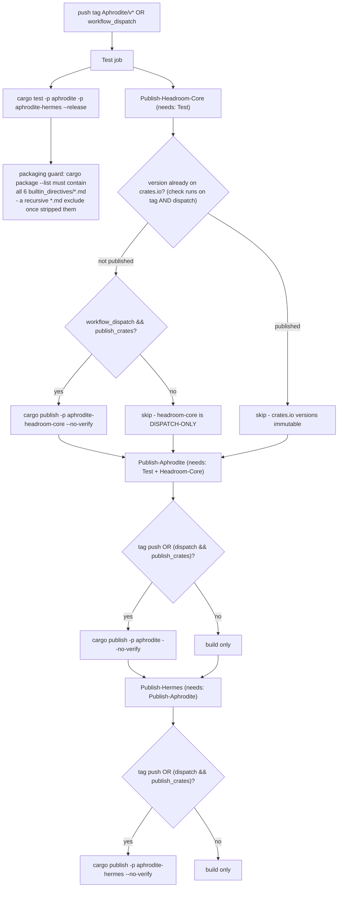

# Release & Publish CI

Two GitHub Actions workflows fire on an `Aphrodite/v*` tag push. `Build.yml` creates the GitHub release once, runs a 4-target build matrix that attaches per-platform assets, and a `Finalize` job that fails loudly if the matrix came out incomplete (12 assets: 4 targets x binary + dylib + SHA256SUMS). `Publish.yml` runs tests plus a packaging guard, then a 3-stage crates.io chain: on a plain tag push the `aphrodite` and `aphrodite-hermes` publish steps do fire, while `aphrodite-headroom-core` (the vendored dependency published under our own namespace) publishes only via explicit `workflow_dispatch` with `publish_crates=true`.

## Build.yml - tag push → release + 4-target matrix

## Publish.yml - test + packaging guard → crates.io chain

Ordering rationale: `aphrodite` path-depends on the vendored `headroom-core` (published under the alias `aphrodite-headroom-core`); `cargo publish` strips the `path` key, so a matching `aphrodite-headroom-core` version must already exist on crates.io - hence the strict Headroom-Core → Aphrodite → Hermes chain. The tag-push publish condition on `aphrodite`/`aphrodite-hermes` means a release tag genuinely publishes the two main crates; only the vendored `aphrodite-headroom-core` publish step is truly dispatch-only, and its version-check step still runs on tag push so the chain is never blocked.
