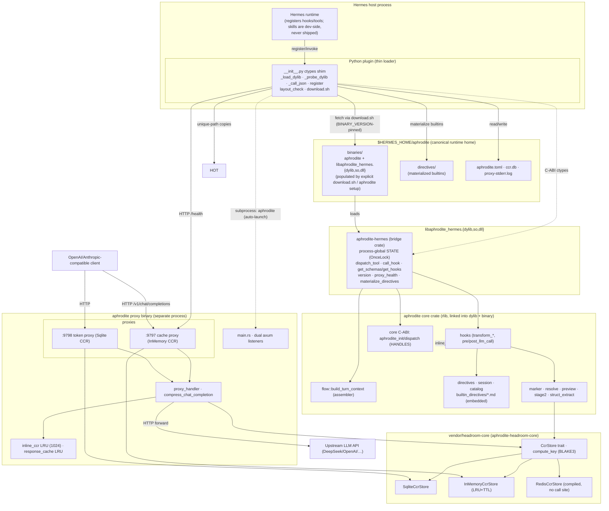

# Component Architecture

Top-level components and the two boundaries that matter: the **C-ABI** (Python shim ↔ Rust dylib) and the **HTTP** boundary (LLM clients / Hermes ↔ the two loopback proxies ↔ upstream API). Runtime artifacts (binary, dylib, config, directives, logs) live in the canonical runtime home `~/.hermes/aphrodite` - the plugin dir holds only the loader + downloader, and layout self-heal (`layout_check.py` + `layout_schema.json`) repairs any misplaced runtime state back to that home at startup.

Boundary notes:

- **C-ABI (dashed ctypes edges):** `aphrodite-hermes` exposes seven `aphrodite_hermes_*` process-global functions (dispatch, hooks, schemas, version, health, directives materialize - no skill export anymore); the core crate additionally exposes handle-based `aphrodite_*` functions (`aphrodite_init` + `aphrodite_dispatch`). Both guard panics so no unwind crosses FFI. Declarations come from the generated `_bindings.py` (cbindgen → ctypesgen), replayed onto the plugin's CDLL handle by `bind_to()` with a manual restype fallback and a `_REQUIRED_VOID_P` completeness assertion.
- **HTTP boundary:** clients and Hermes talk to the two loopback listeners; `loopback_only` + `require_mgmt_token` middleware gate the management routes, and a catch-all route forwards everything else to upstream.
- **Store backends:** token proxy → SQLite, cache proxy → in-memory LRU; Redis is compiled in the vendored crate but wired by no `build_state` arm.
- **Runtime home vs plugin tree:** the plugin is a pure loader. Every runtime artifact resolves from `~/.hermes/aphrodite`, with the env overrides `APHRODITE_BINARY_PATH` / `APHRODITE_HERMES_DYLIB_PATH` / `APHRODITE_HOME` taking precedence; plugin-dir `binaries/` copies survive only as legacy fallbacks, and `layout_check.py` migrates misplaced files back to the canonical home at `register()`.
- The **core crate is linked into both** the dylib (Hermes path) and the proxy binary - the marker/resolve/preview logic is shared, but the two run in separate processes with separate CCR state.
