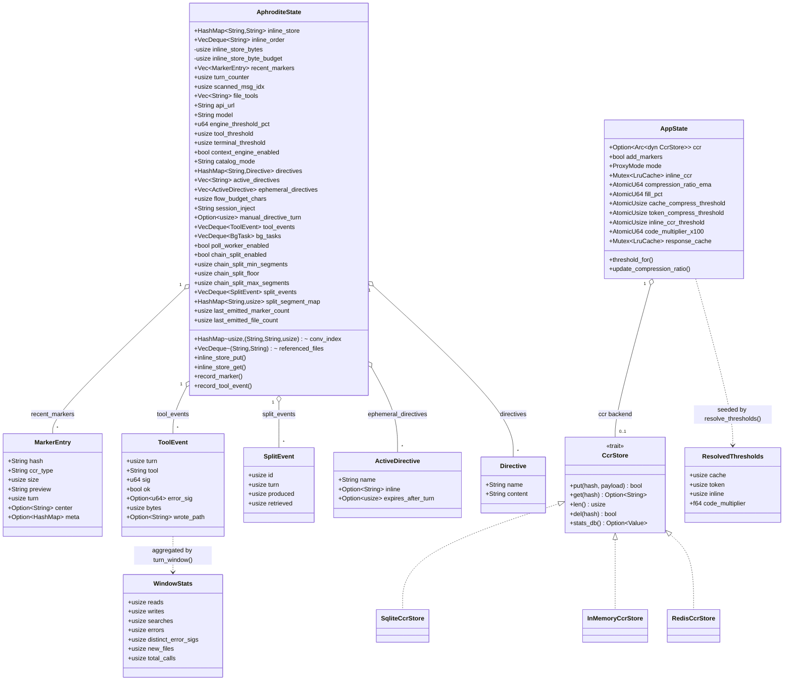

# Core Data Model

The principal data structures behind the compression engine: the per-session `AphroditeState` (FFI/Hermes path), the per-listener `AppState` (proxy path), the marker/event records they hold, and the vendored `CcrStore` trait with its backends. The two runtime states share the marker/CCR concepts but are separate structs in separate processes.

Relationships / invariants:

- `MarkerEntry.hash` is the BLAKE3 `compute_key` (40 hex chars) that also keys `inline_store`; `conv_index[turn] = (hash, summary, size)` records the last marker of that turn (kept for the last 50 turns).
- `inline_store` is a `HashMap` (O(1) get/put) with `inline_order: VecDeque<String>` preserving LRU recency, so eviction drops the least-recent entry from the back. It is bounded by both an entry count (500) and a byte budget (256 MB default).
- `ToolEvent.sig` is an FNV-1a signature of tool + normalized args (volatile keys stripped); `error_sig` hashes error type + first line. `turn_window(n)` folds the ring into `WindowStats` for phase and error-loop detection. Both rings cap at 200 events.
- `SplitEvent` is the chain-split teaching-loop ledger: one entry per split (`produced` segment markers vs `retrieved` distinct hashes). The retrieval ratio adapts `chain_split_min_segments` within `[chain_split_floor, chain_split_max_segments]`; the ring caps at 16 events.
- `ActiveDirective` with `inline` set renders as a `[nudge: …]`; a `name` entry keys into `directives`. `expires_after_turn = None` is permanent, `Some(n)` renders until that turn and is purged afterward.
- `catalog_summary` is delta-only: it emits `+N new compressions this turn` (or a cache-stable "no change" line) using `last_emitted_marker_count` / `last_emitted_file_count`, not a fixed "recent N" listing.
- `AppState` (proxy) holds the live-tunable threshold atomics plus the CCR backend trait object; `AphroditeState` (FFI) holds the directive/turn/telemetry spine plus the chain-split and poll-worker machinery. They are separate structs in separate processes.
