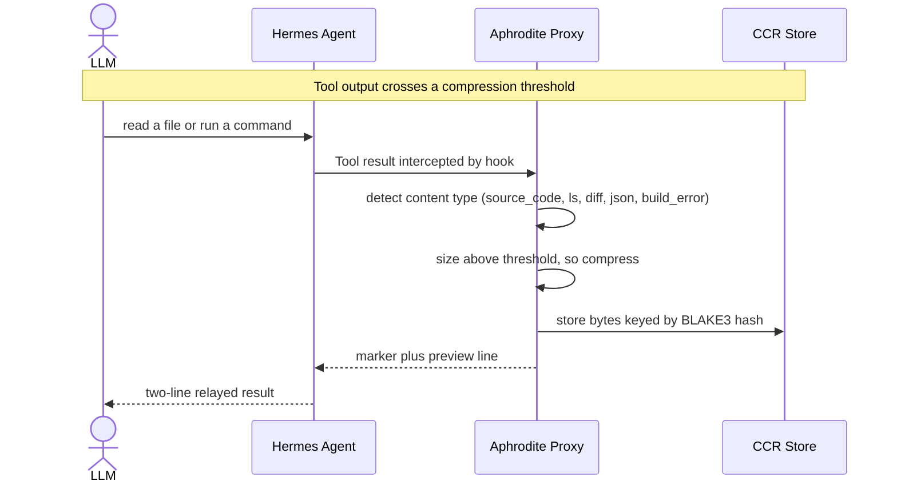
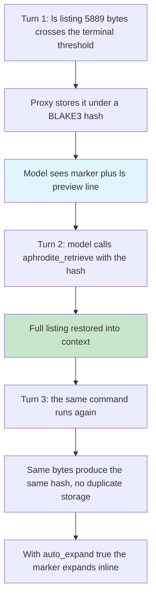

# CCR Examples - What the LLM Actually Sees

Every example on this page is a real tool result captured from a live session
against the 1.4.6 binary. Marker strings are quoted verbatim; hashes are the
BLAKE3 digests the proxy computed for the stored bytes. Because hashing is
content-addressed, the same bytes always produce the same hash - which is why
the same marker reappears across sessions whenever the same output is
compressed.

The marker schema and the retrieval mechanics behind these examples are
documented in [CCR: Marker Format](../ccr/marker-format.md), [CCR:
Lifecycle](../ccr/lifecycle.md), and the content taxonomy in
[Content Types](../classification/content-types.md).

## The Shape of a Compressed Tool Result

When a tool result crosses its compression threshold, the proxy replaces the
raw output in the relayed result with a two-line block:

```
<<<CCR:hash|type|size>>>
[preview line]
```

| Field | Meaning                                                                                |
| ----- | -------------------------------------------------------------------------------------- |
| hash  | BLAKE3 digest of the stored content, first 40 hex characters                           |
| type  | Detected content type (for example `ls`, `source_code`, `diff`, `json`, `build_error`) |
| size  | Original content size in bytes                                                         |

The preview line is a type-aware summary rendered from the content itself -
function counts, key names, error counts, change statistics. The model answers
from the preview when it can, and calls `aphrodite_retrieve` with the hash when
it needs the full content.

### Conversation Flow



Whether the output is compressed at all is decided by the thresholds in
[`[compression]`](../config/aphrodite-toml.md): `tool_threshold_token` (512
bytes default) scaled by `code_multiplier` (3.0 default) for code types, and
`terminal_threshold` (1024 bytes default) for terminal output.

## Scenario 1: Reading a Rust File

`cat bench/corpus/code_rust.rs` produced 2,645 bytes of Rust source - above
the code threshold of 1,536 bytes (512 x 3.0), so the proxy compressed it.

### What the model sees

```
<<<CCR:f8d6c87de81a74c79a9af2909022ffec0534f49c|source_code|2645>>>
[code:9fns fn new(cap:usize) -> Arc<Self> 112L]
```

**What the model reads:**

- 2,645 bytes of source replaced by ~115 characters.
- The preview tells it the file has 9 functions, the first is `fn new(cap:usize)
-> Arc<Self>`, and the file is 112 lines.
- To see the actual code it calls `aphrodite_retrieve("f8d6c87de81a74c79a9af2909022ffec0534f49c")`.

A shorter read stays under the threshold and is relayed raw - for example a
50-line excerpt compressed at 2,370 bytes rendered as
`[code:2fns fn detect_type(content:&str) -> String 50L]`.

## Scenario 2: Build Error

`rustc` on a file with an intentional type error produced 801 bytes of stderr
with two E0308 errors across 11 lines.

### What the model sees

```
<<<CCR:fafc789b89d4659bae6cae77b53414e848fb6ca8|build_error|801>>>
[build:2E 0W 11L | error[E0308]: mismatched types]
```

The preview renders the build family summary - 2 errors, 0 warnings, 11 lines -
and appends the first error line. The model sees the failing diagnostic
directly and only retrieves the full trace when it needs the rest.

## Scenario 3: JSON Tool Output

A 1,728-byte pretty-printed JSON document (nested dictionaries, list of
records, 116 lines) crossed the tool threshold and was compressed.

### What the model sees

```
<<<CCR:2607dcd770e3e7981a9b1c4bb0be22c4995700e6|json|1728>>>
[json:5keys 116L | a, b, c, items, summary]
```

The preview lists the string-named top-level keys and the line count, so the
model knows what the document contains without expanding it.

## Scenario 4: Multi-Turn Memory Flow

Compression is not a one-shot transform: the stored entry stays retrievable
for the session, and content-addressed hashing means the same output maps to
the same entry every time.



- Retrieval is a normal tool call: `aphrodite_retrieve({hash})` returns the
  stored bytes unchanged (`found: true`, `source: "ccr"`).
- The same listing compressed in later sessions yields the identical marker -
  the hash `e357cd16...|ls|5896` reappears byte-for-byte across several
  captures because the tree contents were identical at those moments.
- `auto_expand = true` (default) expands such markers inline so the model sees
  full content without an explicit retrieve; `auto_expand = false` leaves the
  marker and the model retrieves deliberately. Either way the relayed marker
  string is identical - auto-expansion is a client-side behavior.

## Scenario 5: Expanded vs Unexpanded

The same 5,889-byte directory listing, two ways.

### Unexpanded (what the model sees in context)

```
<<<CCR:940fbe9416d6fcf921db14c81580309ed8b98351|ls|5889>>>
[ls:68 files 32 dirs | .json×13 .txt×13 .py×11]
```

~106 characters carry the summary: 68 files, 32 directories, and the extension
histogram.

### Expanded (what the model sees after retrieval)

A real session's retrieval call, verbatim:

```
AphroditeRetrieve("e357cd16e409796079cf2db87f00ea1fc9c1cf69")
Result: {"found": true, "source": "ccr", "hash": "e357cd16...", "content": "total 48\n..."}
```

The full listing replaces the marker in context. The model pays the token cost
only when it actually needs the details.

## Scenario 6: Session Orientation with Directives

Directives are the real session-mode mechanism: the `directives.active` list
selects which directive files from the runtime home
(`~/.hermes/aphrodite/directives/`) are loaded into the per-turn flow budget.
See [Directives](../plugin/directives.md) for the full story.

| Active list             | Behavior captured                                                                |
| ----------------------- | -------------------------------------------------------------------------------- |
| `["focus","foresight"]` | Default. CCR-first retrieval plus anticipate/prefetch orientation.               |
| `["explore"]`           | The agent explored tools (`tool_describe aphrodite_retrieve`) before retrieving. |
| `[]`                    | No directive files loaded.                                                       |

Directives change what the model does, not the marker shape - the relayed
tool-result block (marker + preview) is byte-identical across directive sets,
and directive names not in the active list are silently filtered out.

## Scenario 7: Preview Families - Same Content, Different Previews

The `model_family` setting (`compact`, `code_first`, `balance`) selects which
preview template renders the summary. The same content therefore produces
different preview text:

| Content                            | compact (Claude)                 | code_first (DeepSeek/Qwen)                                          | balance                                                 |
| ---------------------------------- | -------------------------------- | ------------------------------------------------------------------- | ------------------------------------------------------- |
| Directory listing (`ls`)           | `[ls:68 files 32 dirs            | .json×13 .txt×13 .py×11]`                                           | same (ls template is family-independent)                | same |
| Rust source (`source_code`)        | metadata only                    | `[code:9fns fn new(cap:usize) -> Arc<Self> 112L]` (signature first) | `[code:9fns fn new(cap:usize) -> Arc<Self> 113L]`       |
| Go source (`source_code`)          | metadata only                    | -                                                                   | `[code:9fns func Process0(r *Record0, depth int) 607L]` |
| Terminal output with `#[test]` fns | `[test:0 pass 0 fail 0 ignored]` | `[test:0 pass 0 fail 0 ignored]`                                    | `[test:0 pass 0 fail 0 ignored]`                        |

Two more preview knobs from the captures:

- `preview_max_chars` (120 default) caps each rendered preview line; longer
  signatures truncate with an ellipsis.
- `code_structure_map` (true default) controls whether function/type structure
  extraction feeds the code preview; disabled, the preview falls back to
  line-count-only metadata.

## Token Economics

Byte economics of the real captures above - raw stored bytes versus the
marker-plus-preview block that actually enters the model's context:

| Content             | Raw bytes | Marker + preview | Ratio | What the model sees                     |
| ------------------- | --------- | ---------------- | ----- | --------------------------------------- |
| Directory listing   | 5,889     | ~106 chars       | ~56x  | Marker + `[ls:68 files 32 dirs ...]`    |
| Rust source file    | 2,645     | ~115 chars       | ~23x  | Marker + `[code:9fns fn new(...) 112L]` |
| JSON tool output    | 1,728     | ~104 chars       | ~17x  | Marker + `[json:5keys 116L ...]`        |
| Git diff            | 987       | ~114 chars       | ~9x   | Marker + `[diff:1F +31/-0 40L ...]`     |
| Build error (rustc) | 801       | ~117 chars       | ~7x   | Marker + `[build:2E 0W 11L              | error[E0308]: ...]` |

Ratios are byte compression of the relayed result; actual token savings depend
on the tokenizer. The rule of thumb holds across all five: the model sees the
shape and the summary of the content, and pays full price only when it asks
for the details.
