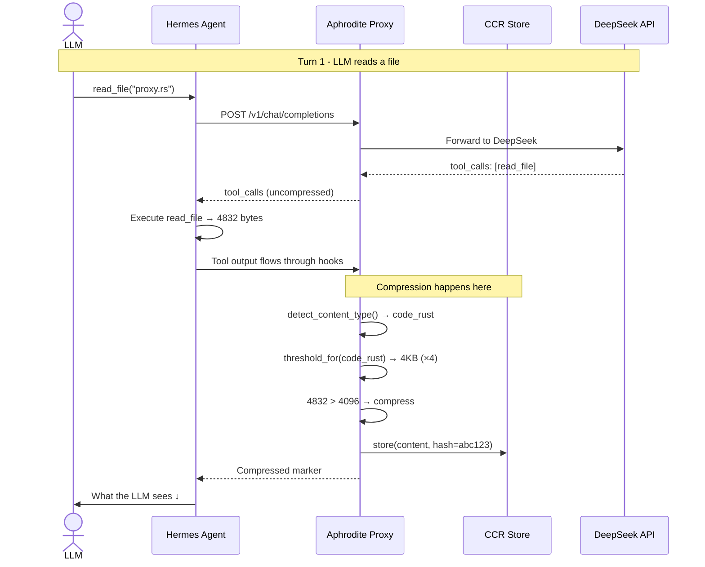
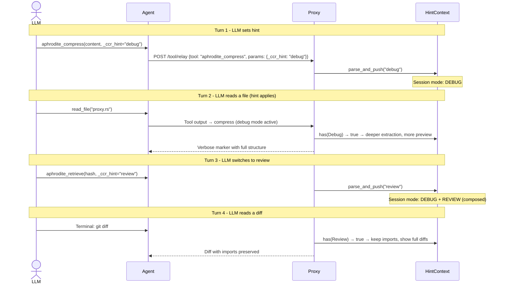

# CCR Examples - What the LLM Actually Sees

## Conversation Flow with Mermaid



## Scenario 1: Reading a Rust File

### Raw (uncompressed - below threshold)

```rust
use std::sync::Arc;
use axum::{Router, extract::State};

fn main() -> anyhow::Result<()> {
    let worker_threads = std::env::var("APHRODITE_WORKER_THREADS")
        .ok()
        .and_then(|v| v.parse::<usize>().ok())
        .unwrap_or(32);
    // ... 150 more lines
}
```

### Compressed (what the LLM sees - v0.5.78)

```
use std::sync::Arc;
use axum::{Router, extract::State};
fn main() -> anyhow::Result<()> {
[code_rust: lang=rs;fns=main,run_single,proxy_handler;structs=AppState,Secret;impls=AppState;traits=CcrStore;ln=414]
<<<CCR:abc123def456|code_rust|4832>>>
```

**The LLM reads:**

- Line 1: Actual code preview (first 3 lines)
- Line 2: Structure summary - knows what functions/structs exist
- Line 3: CCR marker - can call `aphrodite_retrieve("abc123def456")` for full
  content

**Token savings:** 4832 bytes → ~120 bytes (40× compression)

## Scenario 2: Build Error

### Raw

```
error[E0308]: mismatched types
   --> crates/aphrodite/src/proxy.rs:505:18
    |
505 |         script_engine: crate::scripting_enabled().then(|| {
    |                        ^^^^^^^^^^^^^^^^^^^^^^^^^^^^^^^^^^^ expected `Option<()>`, found `Option<Arc<ScriptEngine>>`

For more information about this error, try `rustc --explain E0308`.
error: could not compile `aphrodite` (lib) due to 1 previous error
```

### Compressed

```
error[E0308]: mismatched types
[error: trace=crates/aphrodite/src/proxy.rs:505:18;msg=error[E0308]: mismatched types;N_errors=1]
<<<CCR:def789|error|892>>>
```

**The LLM sees the error line directly** - no need to retrieve unless it wants
the full trace.

## Scenario 3: With Hint - LLM enters debug mode



### What the LLM sees with `_ccr_hint="debug"` active

Same `proxy.rs` read, but now the marker is richer:

```
use std::sync::Arc;
use axum::{Router, extract::State, response::IntoResponse};
fn main() -> anyhow::Result<()> {
async fn run_single(name: String, cli: Cli, rx: watch::Receiver<bool>) -> anyhow::Result<()> {
pub async fn proxy_handler(State(state): State<Arc<AppState>>, method: Method, ...) -> impl IntoResponse {
[code_rust: lang=rs;fns=main,run_single,proxy_handler,loopback_only,shutdown_signal;structs=AppState,Secret;impls=AppState;traits=CcrStore;ln=414]
<<<CCR:abc123def456|code_rust|4832>>
```

**Differences with debug hint:**

- 5-line preview instead of 3 (deeper extraction)
- More function names extracted (lower filter threshold)
- All structural elements included

## Scenario 4: Multi-Turn Memory Flow

```mermaid
graph TD
    A[Turn 1: LLM sets hint=code_rust] --> B[HintContext: {Code(rust)}]
    B --> C[Turn 2: read_file proxy.rs]
    C --> D[Compression: ×4 threshold, extract fns+structs]
    D --> E[LLM sees: structure preview]
    E --> F[Turn 3: LLM sets hint=debug]
    F --> G[HintContext: {Code(rust), Debug}]
    G --> H[Turn 4: cargo build fails]
    H --> I[Compression: error visible, full trace, deeper preview]
    I --> J[LLM sees: error line + structure + marker]
    J --> K[Turn 5: LLM retrieves full content]
    K --> L[aphrodite_retrieve hash=abc123]
    L --> M[Returns full content  -  hint context applied to format]

    style B fill:#e1f5fe
    style G fill:#e1f5fe
    style M fill:#c8e6c9
```

## Scenario 5: Expanded vs Unexpanded

### Unexpanded (what LLM sees in context)

```
use std::sync::Arc;
use axum::{Router, extract::State};
[code_rust: lang=rs;fns=build_state;structs=AppState;ln=1989]
<<<CCR:abc123|code_rust|67097>>>
```

### Expanded (what LLM sees after retrieval)

```
// Full 67,097 bytes of proxy.rs
use std::sync::atomic::{AtomicU64, Ordering};
use std::sync::{Arc, Mutex};
...
pub async fn proxy_handler(...) -> impl IntoResponse { ... }
// ... all 1989 lines
```

### Partial expansion (hint: "structure")

```
[code_rust: lang=rs;fns=build_state,run_single,proxy_handler,handle_tool_relay,handle_ccr_create,smart_marker,generate_metadata,build_preview;structs=AppState,Secret,ToolRelayRequest,CcrCreateRequest;impls=AppState;traits=CcrStore;ln=1989]
```

## Token Economics

| Scenario              | Raw bytes | Compressed | Savings | What LLM pays                       |
| --------------------- | --------- | ---------- | ------- | ----------------------------------- |
| proxy.rs (1989 lines) | 67,097    | ~180       | 373×    | 3 lines + marker                    |
| Build error           | 892       | ~120       | 7×      | Error line + marker                 |
| JSON tool output      | 8,234     | ~140       | 59×     | First line + key count + marker     |
| Git diff (3 files)    | 4,521     | ~150       | 30×     | File names + change counts + marker |
| With debug hint       | 67,097    | ~250       | 268×    | 5 lines + full structure + marker   |
