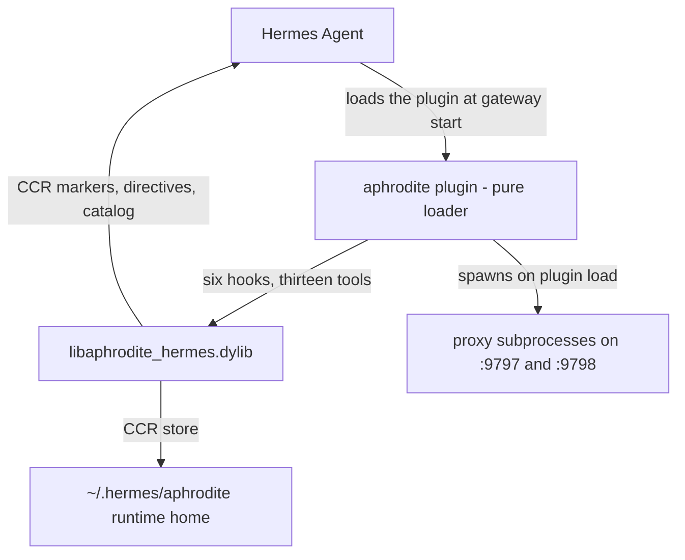

# Hermes Integration

Aphrodite connects to Hermes Agent as a native plugin, not as a proxy you
point a client at. The plugin is a thin Python loader: it registers six
hooks, thirteen tools, and an optional context engine with Hermes, then
forwards every call into a Rust dylib that holds all of the actual behavior.
Two proxy processes - a cache proxy and a token proxy - run alongside as
subprocesses, and a canonical runtime home under `~/.hermes/aphrodite/`
holds the binaries, config, CCR database, directives, and logs.



## The plugin is a pure loader

The plugin directory ships no binaries. It contains the loader
(`__init__.py`), the generated FFI bindings (`_bindings.py`), the download
scripts (`download.sh` / `download.ps1`), the layout self-heal checker
(`layout_check.py`), and `plugin.yaml`. All logic lives in
`libaphrodite_hermes.dylib`, which the loader resolves fresh on each call and
smoke-tests in a subprocess before loading (a faulting image degrades to a
graceful "plugin disabled" instead of killing the gateway).

Registration is driven by the dylib: the shim asks the dylib for its hook
names and tool schemas and registers one callback per name, so the hook set
and tool set are always registered together and a broken callback is
isolated without failing the others. `plugin.yaml` declares the same six
hooks and thirteen tools for Hermes' manifest.

## Hooks

Six hooks connect Aphrodite to the agent loop. Each is a thin dispatch that
forwards its arguments to the dylib and hands the JSON reply back to Hermes.

| Hook                        | When it fires                  | What Aphrodite does                                                         |
| --------------------------- | ------------------------------ | --------------------------------------------------------------------------- |
| `on_session_start`          | A Hermes session starts        | Reset per-session state: turn counter, conversation index, markers, nudges  |
| `pre_tool_call`             | Before a tool executes         | Auto-background long-running calls; split chained commands (opt-in)         |
| `transform_tool_result`     | After every tool call          | Classify the result, compress above threshold, replace it with a CCR marker |
| `transform_terminal_output` | After every terminal execution | Same pipeline for shell stdout/stderr                                       |
| `pre_llm_call`              | Before each LLM request        | Inject directives, nudges, and the recall catalog under a hard byte budget  |
| `post_llm_call`             | After each LLM response        | Archive the turn, advance the counter, expire nudges and stale tasks        |

`transform_tool_result` is where tool output becomes a marker: the result is
classified into a content type, hashed (BLAKE3), stored, and replaced by a
marker of the form `<<<CCR:hash|type|size>>>` with a compact preview. The
agent can recover the exact original bytes with `aphrodite_retrieve`. See
[Plugin Hooks](../plugin/hooks.md) for the full per-hook reference.

## Tools

The plugin registers thirteen `aphrodite_*` tools from the dylib's schemas:
`retrieve`, `compress`, `stats`, `rebuild`, `files`, `diff`, `search`,
`directive`, `test`, `catalog`, `reclassify`, `prefetch`, and
`prefetch_status`. They teach the agent how to interact with the CCR engine -
retrieving stored content, inspecting the catalog, adjusting directives -
and are auto-expanded inline rather than compressed. See
[Tool Relay: Tools](../tool-relay/tools.md) for the reference.

## Context engine

The plugin declares context-engine support and can register a Hermes context
engine when opted in with `APHRODITE_CONTEXT_ENGINE=1`. By default no engine
is registered: the per-turn catalog summary is injected through the
`pre_llm_call` hook instead, so the context assembler remains the single
source of what the model sees. See
[Context Engine](../plugin/context-engine.md) for details.

## Runtime home

The canonical runtime home is `~/.hermes/aphrodite/`:

```
~/.hermes/
├── plugins/
│   └── aphrodite/          ← plugin symlink - a pure loader
└── aphrodite/              ← canonical runtime home
    ├── aphrodite.toml      ← engine and proxy config
    ├── binaries/           ← proxy binary + dylib (auto-downloaded)
    ├── ccr.db              ← SQLite CCR store (created on first run)
    ├── directives/         ← active directive files
    ├── logs/               ← proxy and engine logs
    └── hotreload/          ← hot-reload dylib copies
```

On plugin startup the layout self-heals toward this schema: misplaced
config, binaries, or the CCR database are moved out of the plugin directory
into the runtime home, and a missing plugin symlink is recreated - the
plugin directory stays a pure loader.

## Proxy subprocesses

Two proxies launch when the plugin loads: a cache proxy on `:9797`
(in-memory backend, compresses payloads above 8 KB) and a token proxy on
`:9798` (SQLite backend, compresses above 1 KB). Launch is guarded - the
plugin probes both health endpoints first and skips launching when a healthy
proxy already owns the ports, and `APHRODITE_NO_AUTO_LAUNCH` disables
auto-launch entirely. Each proxy compresses HTTP response bodies for
OpenAI-compatible clients; the Hermes plugin path compresses locally through
the hooks and does not depend on the proxies for its own compression.

## Why not just a proxy?

A generic proxy compresses HTTP response bodies. That helps, but:

1. **Tool output never hits the wire.** Hermes tool calls run locally.
   `transform_tool_result` intercepts the return value before it becomes
   part of the message history. A proxy cannot see this.
2. **Terminal output is local.** `transform_terminal_output` catches shell
   command stdout/stderr before Hermes processes it. The proxy has no
   visibility.
3. **The agent is augmented, not just compressed.** The thirteen
   `aphrodite_*` tools teach the agent how to use the CCR engine, and
   `pre_llm_call` injects directives, nudges, and the recall catalog. A
   proxy is opaque - the agent does not know compression exists.

|                         | Native Hermes plugin                           | Generic proxy (any client)              |
| ----------------------- | ---------------------------------------------- | --------------------------------------- |
| How it works            | Hook registration in `plugin.yaml`             | Point `base_url` at `:9798`             |
| Tool output compression | ✅ `transform_tool_result` intercepts          | ❌ proxy only sees HTTP traffic         |
| Terminal compression    | ✅ `transform_terminal_output`                 | ❌                                      |
| Context engine          | ✅ opt-in; catalog injected via `pre_llm_call` | ❌                                      |
| Auto-launch             | ✅ proxies spawn at plugin load                | ❌ manual `aphrodite` command           |
| `aphrodite_*` tools     | ✅ 13 tools in agent namespace                 | ❌ agent doesn't know about them        |
| Prompt injection        | ✅ directives, nudges, catalog                 | ❌                                      |
| CCR storage             | ✅ token + cache proxy                         | ✅ token + cache proxy                  |
| Works with              | Hermes only                                    | Any OpenAI-compatible client            |
| Setup                   | `hermes plugins enable aphrodite`              | `OPENAI_BASE_URL=http://localhost:9798` |

## What the agent sees

Without Aphrodite, the agent's context fills with raw tool output:

```
500 tokens of build output... scrolling... error? no... warning? no...
ok it passed. That was 500 tokens I'll never get back.
```

With native Hermes integration, `transform_tool_result` replaces it:

```
[build:0E 0W 1L]  ← a few tokens. The agent knows: build passed.
```

The agent retrieves the full output with `aphrodite_retrieve(hash)` only
when it actually needs it - for clean builds, exit=0 terminals, and small
diffs, the preview is enough.

## Setup

There are three install paths - the Hermes plugin with auto-download
(recommended), `cargo install aphrodite` + `aphrodite setup`, and building
from source. See [Installing Aphrodite](../install/README.md) for the full
walkthrough and per-platform details. Short version for the plugin path:

```bash
git clone https://github.com/PlayForm/Aphrodite-Hermes.git
ln -s "$(pwd)/Aphrodite-Hermes" ~/.hermes/plugins/aphrodite
hermes plugins enable aphrodite
hermes # restart so the plugin loads fresh
```

On first launch the plugin checks `~/.hermes/aphrodite/binaries/`; if the
binary or the dylib is missing, it runs `download.sh` itself (SHA-256
verified) before starting the proxy. No Rust toolchain needed.

## See also

- [Plugin Hooks](../plugin/hooks.md) - the six hooks, thresholds, and bypass gates
- [Tool Relay: Tools](../tool-relay/tools.md) - the thirteen `aphrodite_*` tools
- [Directives](../plugin/directives.md) - the `[directives: ...]` block injected by `pre_llm_call`
- [Context Engine](../plugin/context-engine.md) - the optional Hermes context-engine integration
- [Installing Aphrodite](../install/README.md) - all three install paths and troubleshooting
