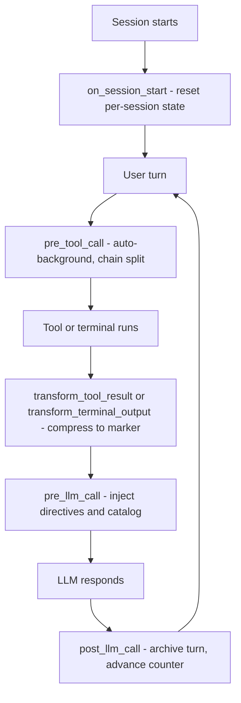

# Plugin Hooks

The plugin registers six hooks with Hermes. Every hook is a thin dispatch that
forwards its arguments to the Rust dylib (`libaphrodite_hermes.dylib`); the
dylib holds all of the actual behavior and replies with JSON that the Python
module hands back to Hermes.

Registration is driven by the dylib's hook list: on plugin load the shim asks
the dylib for its hook names and registers one callback per name, so the six
hooks below are always registered together. `plugin.yaml` declares the same
set under `provides_hooks`.

| Hook                        | Purpose                                                        | When it fires                          |
| --------------------------- | -------------------------------------------------------------- | -------------------------------------- |
| `on_session_start`          | Reset all per-session state to a clean baseline                | A Hermes session starts                |
| `pre_tool_call`             | Auto-background long-running calls; split chained commands     | Before a tool executes                 |
| `transform_tool_result`     | Compress large tool results into CCR markers                   | After every tool call                  |
| `transform_terminal_output` | Compress large terminal output into CCR markers                | After every terminal execution         |
| `pre_llm_call`              | Inject directives, nudges, and the recall catalog              | Before each LLM request                |
| `post_llm_call`             | Archive the turn, advance the counter, expire stale state      | After each LLM response                |

## on_session_start

Fires when a Hermes session starts. It resets every piece of per-session
state to a clean baseline: the turn counter, the conversation index, recent
markers, referenced files, tool-event telemetry, ephemeral directives, and
the manual directive latch.

It injects nothing. The one-shot first-turn orientation is rendered later by
the context assembler on the first `pre_llm_call` (see below), so a session
reset followed by a fresh turn behaves exactly like a new session.

## pre_tool_call

Fires before a tool executes and can modify the pending call. Two
interventions are possible, both driven by the poll worker and chain-split
features:

- **Auto-backgrounding.** When the poll worker is enabled
  (`APHRODITE_POLL_WORKER`, default on), a `terminal` or `process` call whose
  command matches the long-running patterns is rewritten to run in the
  background: the hook returns a modify action with `background: true` and
  `notify_on_complete: true`, and Hermes runs the tool asynchronously. The
  agent observes completion through its normal poll flow. `process` calls
  with `action: poll` are never backgrounded - they are checks, not work.
- **Chain splitting.** When chain splitting is enabled
  (`APHRODITE_CHAIN_SPLIT=1` or `[compression] chain_split = true`, default
  off), a chained terminal command (`cd x && cargo build && cargo test`) is
  rewritten with invisible segment markers, provided it has at least
  `chain_split_min_segments` segments. The marker-splitting lets
  `transform_terminal_output` compress each segment into its own CCR marker,
  so the model sees several compact previews instead of one large blob.

If neither intervention applies, the call passes through unchanged.

## transform_tool_result

Fires after every tool call with the tool's result. The pipeline:

1. **Telemetry.** The call's status, error type/message, arguments, and
   duration are recorded into the tool-event ring, which feeds the
   error-loop and phase detectors. Empty results are skipped here.
2. **Skip gates.** A result is left untouched when it is empty; when the tool
   is in the essential set (`skill_view`, `skills_list`, `skill_manage`,
   `memory`, `session_search`, `read_file`, `read_terminal` - the agent needs
   raw output); when it is one of Aphrodite's own tools or a headroom helper
   (already compact metadata, and compressing `aphrodite_retrieve` would
   replace resolved content with another marker); or when it is below the
   tool threshold (default 4,096 characters; `0` disables the gate and always
   compresses).
3. **Classify.** The content-type detector assigns a type; generic
   text/log/plain results get a semantic upgrade (git status, ls, test, grep)
   so the preview carries high-signal shape.
4. **Store.** The content is hashed (BLAKE3), stored in the inline store, and
   replaced by a marker of the form `<<<CCR:hash|type|size>>>` with a preview.
   Hermes swaps the tool output for the marker; retrieval returns the exact
   original bytes.

File references are tracked before the skip gates, so `read_file` and
`search_files` results are recorded for `aphrodite_files` and the catalog
even when they are never compressed.

## transform_terminal_output

Fires after every terminal execution. The pipeline mirrors tool results:

1. **Telemetry.** The command and return code are recorded; a non-zero exit
   code marks the event as a failure and feeds the error-loop detector.
2. **Chain split.** When chain splitting is enabled and the output carries
   the segment markers injected by `pre_tool_call`, each segment is
   compressed into its own marker (unconditional, before the threshold gate,
   so marked output never leaks raw). Per-segment error hints are merged into
   previews.
3. **Threshold gate.** Unmarked output below the terminal threshold (default
   1,024 characters; `0` disables the gate) passes through untouched.
4. **Classify and store.** Output containing `exit code:` or `Error:` is
   typed `terminal`; other output gets the normal content-type detection with
   the same semantic upgrade as tool results. Above-threshold content is
   hashed, stored, and replaced by a marker.

## pre_llm_call

Fires before each LLM request. It first runs the poll-worker checkpoint
(pushing status nudges for running, completed, and failed background tasks),
then the single context assembler composes the per-turn injection. The
assembler builds every section in a fixed order under one hard byte cap
(`flow_budget_chars`, default 4,000), dropping sections from the bottom when
over budget:

1. First-turn orientation (`[aphrodite: first-turn orientation]`, turn 0 only)
2. `[directives: ...]` block - never dropped
3. `[nudge: ...]` one-shots, at most two - never dropped
4. Background-task status
5. `[recall]` catalog summary - the first section dropped under budget
   pressure

The first-turn orientation is built from the `[prompts] session_inject`
template (default compiled into the binary, `{VERSION}` interpolated to the
plugin version). It is injected once on turn 0, then never again; an empty
string disables it entirely.

The hook returns `{"context": ...}`, which Hermes injects into the model's
turn. When the assembled context is empty, nothing is injected.

## post_llm_call

Fires after each LLM response. It archives the last marker recorded this
turn into the conversation index (so `aphrodite_diff` can report per-turn
compressions), advances the turn counter, purges expired nudges (after the
counter advances, so a one-shot nudge renders exactly once), and expires
stale poll-worker tasks.

## Thresholds

| Hook                        | Setting                          | Default | Bypass                                            |
| --------------------------- | -------------------------------- | ------- | ------------------------------------------------- |
| `transform_tool_result`     | `[compression] tool_threshold_token` | 4,096 | empty, essential tools, self tools, below threshold; `0` = always compress |
| `transform_terminal_output` | `[compression] terminal_threshold`   | 1,024 | empty, below threshold; `0` = always compress     |
| `pre_llm_call`              | `[flow] budget_chars`            | 4,000  | recall catalog dropped first; directives and nudges never drop |
| `pre_tool_call` (chain split) | `[compression] chain_split_min_segments` | -    | feature off by default (`chain_split = false`)    |

Each setting has an environment-variable equivalent (`APHRODITE_TOOL_THRESHOLD_TOKEN`,
`APHRODITE_TERMINAL_THRESHOLD`, `APHRODITE_FLOW_BUDGET_CHARS`,
`APHRODITE_CHAIN_SPLIT`); environment overrides TOML, which overrides the
default. See [aphrodite.toml Configuration](https://github.com/PlayForm/Aphrodite/tree/Current/docs/config/aphrodite-toml.md)
for the full schema.

## See also

- [Directives](https://github.com/PlayForm/Aphrodite/tree/Current/docs/plugin/directives.md) - the `[directives: ...]` block injected by `pre_llm_call`
- [Context Engine](https://github.com/PlayForm/Aphrodite/tree/Current/docs/plugin/context-engine.md) - the Hermes context-engine integration point
- [Tool Relay: Tools](https://github.com/PlayForm/Aphrodite/tree/Current/docs/tool-relay/tools.md) - the tools these hooks coordinate with